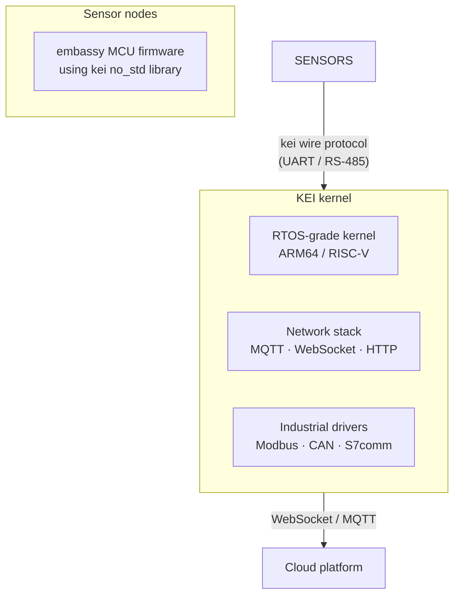

<p align="center"></p>

<h1 align="center">KEI</h1>

<p align="center"><strong>A Rust OS kernel for industrial IoT edge devices.</strong></p>

<div align="center">

[](./LICENSE)
[](./LICENSE-MPL)
[](https://github.com/celestia-island/kei/actions/workflows/ci.yml)

</div>

<div align="center">

**English** ·
[简体中文](./docs/zhs/README.md) ·
[繁體中文](./docs/zht/README.md) ·
[日本語](./docs/ja/README.md) ·
[한국어](./docs/ko/README.md) ·
[Français](./docs/fr/README.md) ·
[Español](./docs/es/README.md) ·
[Русский](./docs/ru/README.md) ·
[العربية](./docs/ar/README.md)

</div>

## What is KEI?

KEI is a Rust OS kernel for ARM64 and RISC-V edge devices. It also ships a
`#![no_std]` library for embassy sensor nodes.

KEI is derived from [Asterinas](https://github.com/asterinas/asterinas),
a Rust framekernel. It adds ARM64 board support, virtio-gpu display, industrial
drivers, and a sensor-node wire protocol — while staying independent of upstream
release cycles.



## What's in this repo?

| Component | Location | What it does |
|-----------|----------|-------------|
| **KEI kernel** | workspace root | Rust OS kernel for ARM64/RISC-V. Syscall ABI, virtio-gpu, framebuffer, network stack. |
| **kei library** | `packages/kei/` | `#![no_std]` library for embassy sensor nodes: wire protocol, manifest schema, HAL traits. |

## Quick start

**Kernel:**
```bash
just build        # Build for default board (NanoPi R3S)
just test-all     # Boot-test all architectures in QEMU
```

**Library:**
```bash
cd packages/kei
cargo test --all-features    # 20 tests
cargo run --example host_demo  # Wire protocol demo
```

See the [library guide](./docs/en/guides/kei-library.md) and
[benchmark results](./docs/en/guides/wire-protocol-benchmarks.md) for details.

## Desktop rendering (aris)

The aris-render desktop (Blitz HTML/CSS layout + Vello CPU rasterization →
`/dev/fb0`) requires the [aris](https://github.com/celestia-island/aris)
repository. Point kei at your aris checkout via the `ARIS_REPO` environment
variable:

```bash
cp .env.example .env
# Edit .env and set ARIS_REPO to your aris repo path, e.g.:
#   ARIS_REPO=../aris        (sibling directory — the default)
#   ARIS_REPO=/home/me/aris  (absolute POSIX path)
#   ARIS_REPO=D:\source\aris (absolute Windows path)
```

Build commands follow a two-level convention (`just build <object>`):

```bash
just build browser aarch64   # compile aris browser engine only (musl cross)
just build desktop aarch64   # full stack: kernel + browser + initramfs
just render aarch64          # launch QEMU with aris-rendered desktop
```

The justfile auto-loads `.env` (via `set dotenv-load`). If `ARIS_REPO` is
unset, it falls back to `../aris` (sibling directory layout).

## License

SySL-1.0 for KEI's own code. Vendored Asterinas code under MPL-2.0.
See [LICENSE](./LICENSE) and [LICENSE-MPL](./LICENSE-MPL).
