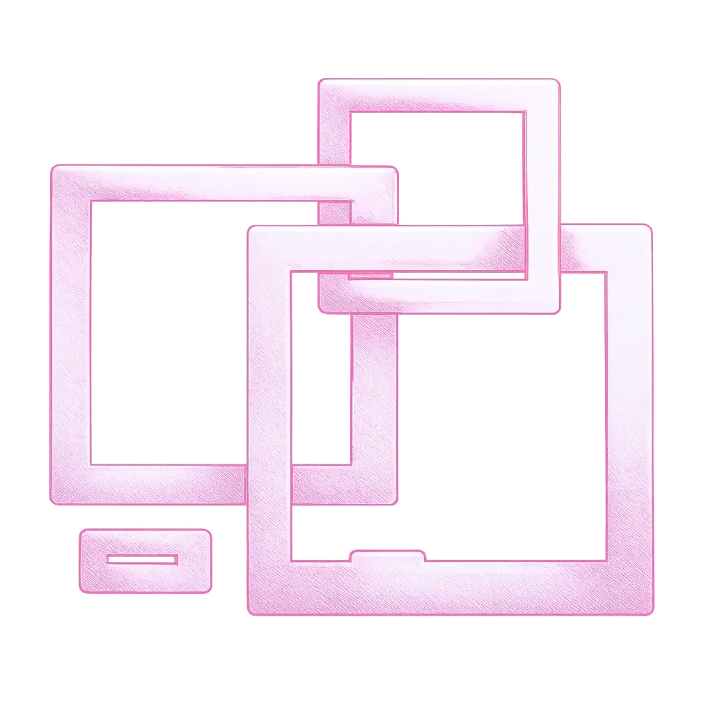
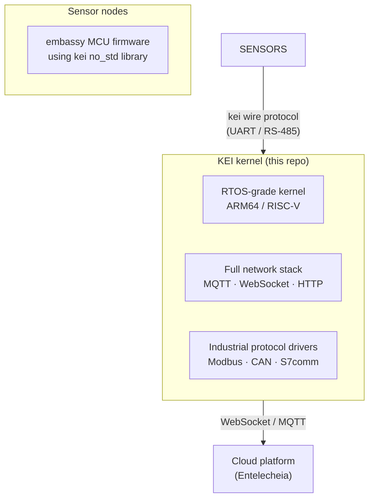

<p align="center"></p>

<h1 align="center">KEI</h1>

<p align="center"><strong>Rust OS kernel for industrial IoT gateways + no_std bridge library for embedded sensor nodes</strong></p>

<div align="center">

[](./LICENSE)
[](./LICENSE-MPL)
[](https://github.com/celestia-island/kei/actions/workflows/ci.yml)

</div>

<div align="center">

**English** ·
[简体中文](./docs/zhs/README.md) ·
[繁體中文](./docs/zht/README.md) ·
[日本語](./docs/ja/README.md) ·
[한국어](./docs/ko/README.md) ·
[Français](./docs/fr/README.md) ·
[Español](./docs/es/README.md) ·
[Русский](./docs/ru/README.md) ·
[العربية](./docs/ar/README.md)

</div>

## What problem does KEI solve?

Industrial IoT gateways sit between field devices (sensors, PLCs, actuators)
and the cloud. They need real-time discipline for protocol polling, a full
network stack for cloud connectivity, safety guarantees that C-based RTOSes
and full Linux cannot provide, and a small auditable footprint.

KEI is built in Rust on a safe-kernel architecture, giving you memory safety,
real-time capability, and a complete protocol stack in one system.



## What's in this repo?

| Component | Location | What it does |
|-----------|----------|-------------|
| **KEI kernel** | workspace root | Rust OS kernel for ARM64/RISC-V edge devices. Runs the [evernight](https://github.com/celestia-island/evernight) protocol broker. |
| **kei library** | `packages/kei/` | `#![no_std]` library for embassy sensor nodes: wire protocol, manifest schema, HAL traits. |

## Quick start

**Kernel:**
```bash
just build        # Build for default board (NanoPi R3S)
just test-all     # Boot-test all architectures in QEMU
```

**Library:**
```bash
cd packages/kei
cargo test --all-features    # 20 tests
cargo run --example host_demo  # Wire protocol demo
```

See the [library guide](./docs/en/guides/kei-library.md) and
[benchmark results](./docs/en/guides/wire-protocol-benchmarks.md) for details.

## Ecosystem

- **[aris](https://github.com/celestia-island/aris)** — gateway Linux distribution
- **[evernight](https://github.com/celestia-island/evernight)** — industrial protocol broker
- **[kei](https://github.com/celestia-island/kei)** — this repo

## License

SySL-1.0 for KEI's own code. Vendored code under MPL-2.0.
See [LICENSE](./LICENSE) and [LICENSE-MPL](./LICENSE-MPL).
