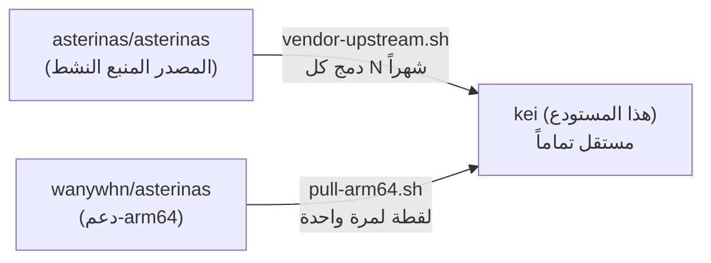

<p align="center" dir="rtl"></p>

<h1 align="center">KEI</h1>

<p align="center" dir="rtl"><strong>نواة نظام تشغيل موجّهة لِإنترنت الأشياء (IoT) — انضباط RTOS فوق Asterinas، مع الوصول إلى منظومة لينكس</strong></p>

<div align="center">

[](../../LICENSE)
[](../../LICENSE-MPL)
[](https://github.com/celestia-island/kei/actions/workflows/ci.yml)

</div>

<div align="center">

[English](../en/README.md) ·
[简体中文](../zhs/README.md) ·
[繁體中文](../zht/README.md) ·
[日本語](../ja/README.md) ·
[한국어](../ko/README.md) ·
[Français](../fr/README.md) ·
[Español](../es/README.md) ·
[Русский](../ru/README.md) ·
**[العربية](../ar/README.md)**

</div>

## مقدمة

KEI نواة نظام تشغيل مبنية خصيصاً لِإنترنت الأشياء الصناعي. تأخذ Asterinas وتصوغها
على هيئة بنية بأسلوب RTOS — صغيرة وزمنية حقيقية وقابلة للتدقيق — لكنها تحتفظ
بجسر إلى منظومة لينكس بحيث تبقى التعريفات والأدوات والملفات الثنائية القائمة في
المتناول. ليست توزيعة لينكس ولا Asterinas كما هي. أقرب نظيرٍ لها RTOSٌ يحدث أن
يتحدّث لينكس: حتمية زمنية حقيقية للأحمال التي تحتاجها، وتوافقٌ برمجي بمستوى
لينكس لكل ما سوى ذلك.

## نموذج التفرّع

KEI **ليس** فرعاً يتتبّع المصدر المنبع (upstream). إنه تفرّع مستقل
يمتصّ تغييرات المصدر المنبع دورياً وفق جدوله الخاص — نفس النموذج
الذي تستخدمه Apple لتفرّعها الخاص بـ LLVM.



يحافظ kei بشكل مستقل على `ostd/src/arch/aarch64/` و `kernel/src/arch/aarch64/`
و `bsp/` و `board/` و `configs/` و `docs/`.

## البداية السريعة

```bash
just setup        # Configure git remotes
just vendor       # Absorb latest upstream asterinas (squash)
just pull-arm64   # Pull ARM64 code from wanywhn fork (one-time)
just versions     # Show what upstream versions we're based on
just build        # Build kernel for nanopi-r3s (aarch64)
just test-all     # Boot-test all architectures in QEMU
```

## أين يوجد كل شيء

| الدليل | المصدر | الصيانة |
|--------|--------|---------|
| `ostd/` | Asterinas المنبع | مُدمج دورياً، تُصلح الأخطاء في مكانها |
| `ostd/src/arch/aarch64/` | تفرّع wanywhn (PR #3270) | **مستقل** — نملكه نحن |
| `kernel/` | Asterinas المنبع | مُدمج دورياً |
| `kernel/src/arch/aarch64/` | تفرّع wanywhn (PR #3270) | **مستقل** — نملكه نحن |
| `osdk/` | Asterinas المنبع | مُدمج دورياً |
| `bsp/` | kei | **100% لنا** — حزم دعم اللوحات |
| `board/` `configs/` | kei | **100% لنا** — تعريفات اللوحات |
| `scripts/` `docs/` | kei | **100% لنا** — الأدوات والتوثيق |

## المعماريّات المدعومة

| المعمارية | الحالة | اختبار QEMU |
|-----------|--------|-------------|
| x86_64 | المنبع المستوى 1 | ✅ q35 |
| aarch64 | تُدعم من kei (من PR #3270) | ✅ virt/cortex-a55 |
| riscv64 | المنبع المستوى 2 | ⚠️ virt/rv64 |
| loongarch64 | المنبع المستوى 3 | ⚠️ virt/max |

## الترخيص

SySL-1.0 (Synthetic Source License) — راجع [LICENSE](../../LICENSE). كود Asterinas المُدمج (`ostd/`، `kernel/`، `osdk/`) يبقى تحت MPL-2.0 — راجع [LICENSE-MPL](../../LICENSE-MPL).
