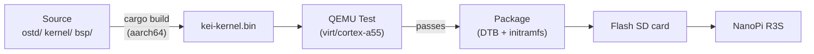
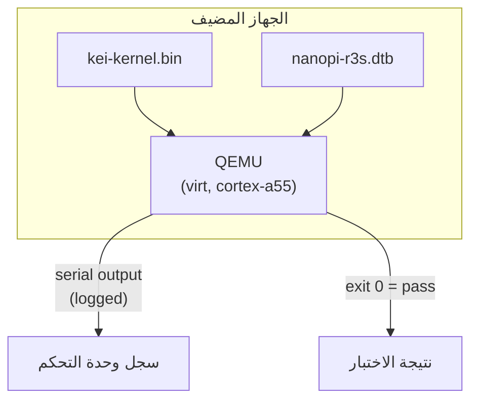
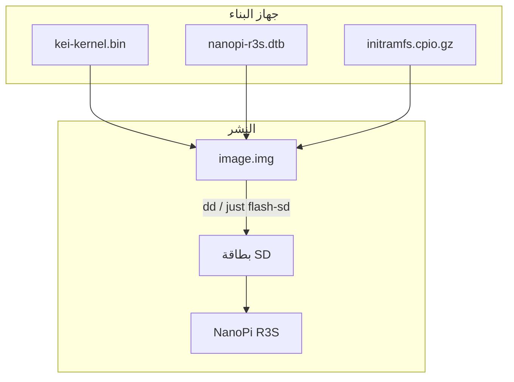
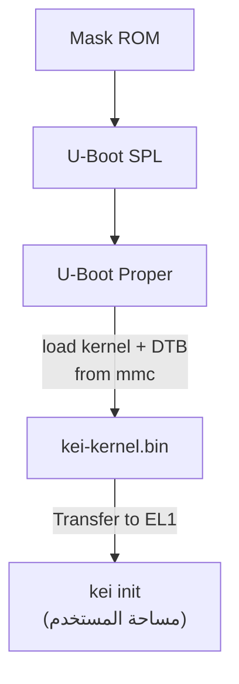

# kei البناء والنشر

## نظرة عامة

ينتج kei ملف `kei-kernel.bin` — نواة Asterinas المُمكَّنة لـ ARM64. يغطي هذا
الدليل بناء النواة واختبارها في QEMU ونشرها على الأجهزة الفعلية.

## خط أنابيب البناء



## المتطلبات الأساسية

- **المضيف**: Linux x86_64 أو ARM64
- **Rust**: 1.85+ مع هدف `aarch64-unknown-none-softfloat`
- **QEMU**: ≥ 8.0 لآلة virt مع cortex-a55
- **just**: `cargo install just`

## بناء سريع

```bash
# One-time setup
just setup        # Configure git remotes and Rust targets

# Sync upstream sources
just vendor       # Absorb latest upstream asterinas (squash)
just versions     # Show upstream baseline versions

# Build for the NanoPi R3S
just build        # Builds kei-kernel.bin for aarch64/armv8

# Run QEMU boot tests
just test-all     # Boot-tests all supported architectures
```

## الترجمة المتقاطعة

للترجمة المتقاطعة من x86_64 إلى aarch64:

```bash
# Add the ARM64 target (one-time)
rustup target add aarch64-unknown-none-softfloat

# Install GCC cross-toolchain (distribution-dependent)
# Ubuntu / Debian:
sudo apt install gcc-aarch64-linux-gnu binutils-aarch64-linux-gnu

# Build
cargo build --release --target aarch64-unknown-none-softfloat \
  -p kei-kernel
```

ملف النواة الثنائي هو صورة ARM64 خام (بروتوكول إقلاع Linux)، وليس ELF. يتم
الإقلاع مباشرة من U-Boot عبر أمر `booti`.

## اختبار QEMU

اختبر النواة في QEMU قبل النشر على العتاد:



### مصفوفة الاختبار

| آلة QEMU | CPU | RAM | الحالة | الأمر |
|-------------|-----|-----|--------|---------|
| virt | cortex-a55 | 2GB | ✅ أساسي | `just test` |
| virt | cortex-a72 | 2GB | 🔲 مخطط | — |
| virt | max | 4GB | 🔲 مخطط | — |
| sbsa-ref | max | 4GB | 🔲 مخطط | — |

```bash
# Run the primary test target
just test

# Manual QEMU invocation
qemu-system-aarch64 \
  -machine virt,gic-version=3 \
  -cpu cortex-a55 \
  -m 2G \
  -kernel output/kei-kernel.bin \
  -nographic
```

## النشر الفعلي

### NanoPi R3S

نشر kei على NanoPi R3S فعلي:



### النسخ على بطاقة SD

```bash
# Build the complete firmware image (includes kei-kernel.bin)
just build-board nanopi-r3s

# Flash to SD card
sudo dd if=output/nanopi-r3s/image.img of=/dev/sdX bs=4M status=progress
sync
```

### التحقق من الإقلاع

بعد إدخال بطاقة SD وتشغيل الطاقة، اتصل عبر USB-TTL التسلسلي (1500000 باود،
8N1):

```
U-Boot 2024.01 (Jan 01 2024 - 00:00:00 +0000)
...
## Loading kernel from mmc 0:1
   Image Name:   kei-kernel
   Image Type:   AArch64 Linux Kernel Image
   Data Size:    4194304 Bytes = 4 MiB
   Load Address: 00000000
   Entry Point:  00000000
## Flattened Device Tree blob at 44000000
   Booting using the fdt blob at 0x44000000

kei-kernel booting...
[KEI] initialising GICv3...
[KEI] initialising ARM Generic Timer...
[KEI] starting SMP...
[KEI] 4 cores online
...
```

### ترتيب الإقلاع



## استكشاف الأخطاء

| العَرَض | السبب المحتمل | الإجراء |
|---------|-------------|--------|
| لا يوجد إخراج تسلسلي | معدل باود خاطئ | استخدم 1500000، وليس 115200 |
| فشل تهيئة GICv3 | نوع آلة QEMU | استخدم `virt,gic-version=3` |
| فشل SMP | PSCI مفقود في DTB | تحقق من عقدة `/cpus` في شجرة الجهاز |
| Kernel panic | خطأ في كود طبقة الهندسة المعمارية | تدقيق `ostd/src/arch/aarch64/` |
| U-Boot لا يجد النواة | إزاحة قسم خاطئة | تحقق من الإزاحة في `boot.scr` |
