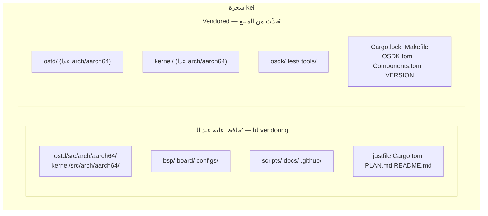
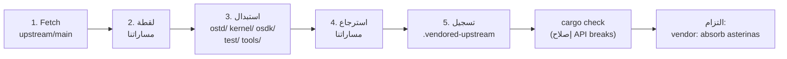

# kei مزامنة المنبع (Vendoring)

## نظرة عامة

kei هو **تفرّع مستقل** عن
[asterinas/asterinas](https://github.com/asterinas/asterinas). وهو **لا** يتتبّع
المنبع عبر `git merge`. بل يمتص تغييرات المنبع دوريًا عبر **squash vendoring**
— وهو النموذج نفسه الذي تستخدمه Apple لتفريعة LLVM الخاصة بها. يشرح هذا الدليل
السبب، وما الذي تتم مزامنته، وكيفية تنفيذ مزامنة مع المنبع بدقة.

## لماذا لا `git merge`؟

فرع dev في kei **لا يشارك أي سلف git** مع `upstream/main` — هذا متعمّد وليس
سهوًا:

```bash
$ git merge-base dev upstream/main
fatal: not a single merge base  # ← متوقّع
```

| المقاربة | الحكم | السبب |
|----------|-------|-------|
| تتبّع عبر `git merge` | ❌ | نقل بنية ARM64 المكوّن من 4475 سطرًا يجعل كل merge مثقلًا بالتعارضات ومكلفًا |
| سلسلة رُقع (quilt) | ❌ | هشّة عند هذا الحجم، دون دعم IDE |
| **تفريعة مستقلة + squash vendor** | ✅ | تحكّم كامل؛ امتصاص المنبع وفق جدولنا؛ حل التعارضات دفعة واحدة وقت الـ vendor |

ثمن هذا النموذج: لا يستطيع `git log` / `git blame` تتبّع تأريخ ملف عبر حدّ الـ
vendor (يُضغط كل امتصاص في التزام واحد). هذه المفاضلة المقبولة مقابل امتصاص
منبع رخيص وقابل للتنبؤ.

## ما الذي لنا مقابل ما هو vendored



| المسار | المصدر | عند `just vendor` |
|--------|--------|-------------------|
| `ostd/src/arch/aarch64/` | تفريعة wanywhn (PR #3270) | **يُحافظ عليه** (لنا) |
| `kernel/src/arch/aarch64/` | تفريعة wanywhn (PR #3270) | **يُحافظ عليه** (لنا) |
| `bsp/` `board/` `configs/` | kei | **يُحافظ عليه** (لنا) |
| `scripts/` `docs/` `.github/` | kei | **يُحافظ عليه** (لنا) |
| `ostd/` (الباقي) | المنبع | استبدال كامل |
| `kernel/` (الباقي) | المنبع | استبدال كامل |
| `osdk/` `test/` `tools/` | المنبع | استبدال كامل |
| `Cargo.lock` `Makefile` `OSDK.toml` `Components.toml` `VERSION` | المنبع | تُستبدل (`Cargo.toml` يُدمج لا يُستبدل) |

## كيف يعمل الـ vendoring (5 خطوات)

ينفّذ `scripts/vendor_upstream.py` استبدالًا على مستوى الدليل، **وليس** git
merge. العملية الكاملة:



1. **Fetch** —— `git fetch upstream main` (أو ref مُثبَّت).
2. **لقطة** —— تُنسخ مساراتنا إلى دليل مؤقت (مع حفظ الروابط الرمزية).
3. **استبدال** —— تُحذف `ostd/` و`kernel/` و`osdk/` و`test/` و`tools/` وتُعاد
   checkout من `upstream/main`. كذلك تُحدَّث الملفات الجذرية (`Cargo.lock`،
   `Makefile`، `OSDK.toml`، `Components.toml`، `VERSION`).
4. **استرجاع** —— تُعاد مساراتنا فوق الكل، بما في ذلك كود بنية ARM64
   (`ostd/src/arch/aarch64/`، `kernel/src/arch/aarch64/`).
5. **تسجيل** —— يُعاد كتابة `.vendored-upstream` بـ SHA المنبع الجديد وref
   والتاريخ وختم زمن الـ vendor.

السكربت **لا** يلتزم تلقائيًا. بعد انتهائه عليك التحقق ثم الالتزام بنفسك (انظر
[سير العمل](#سير-العمل) أدناه).

## سير العمل

### المتطلبات المسبقة

يُعدّ `just setup` الريموتين `upstream` و`arm64`:

```bash
just setup        # يُعدّ ريموتات git (upstream، arm64) وأهداف Rust
```

إذا كانت بيئتك تتطلّب وكيلًا (proxy)، فاضبط `HTTPS_PROXY` / `HTTP_PROXY` قبل
تشغيل vendor (تقرؤها السكربتات). ولجعل GitHub يتجاوز الوكيل، صدّر
`NO_PROXY='*'`.

### امتصاص المنبع (مزامنة دورية)

```bash
# 1. تشغيل الـ vendor (يجلب upstream/main، يستبدل أدلة vendored، يستعيد كودنا)
just vendor

# 2. عرض ما تغيّر
git status
git diff --stat

# 3. إصلاح أي API breaks ناتجة عن تغييرات المنبع
cargo check
just test-all

# 4. الالتزام بالنتيجة كنقطة squash واحدة
git add -A
git commit -m "vendor: absorb asterinas <upstream-sha>"
```

لعمل vendor لالتزام أو وسم محدّد بدل `main`:

```bash
just vendor-ref v0.12.0      # justfile: just vendor-ref <ref>
# أو مباشرة:
python3 scripts/vendor_upstream.py <commit-sha-or-tag>
```

### سحب كود ARM64 (لمرة واحدة، أو إعادة مزامنة نادرة)

كود بنية ARM64 قادم من
[`wanywhn/asterinas`](https://github.com/wanywhn/asterinas) (الفرع
`arm64-support`، PR asterinas/asterinas#3270). بعد السحب الأولى يُصان بشكل
مستقل داخل kei.

```bash
just pull-arm64              # لقطة لمرة واحدة من wanywhn/asterinas
just pull-arm64-ref <ref>    # إعادة مزامنة إلى التزام محدّد (نادر)
```

### فحص الأسس الحالية

```bash
just versions                # يطبع .vendored-upstream و.vendored-arm64
```

مثال الخرج:

```
=== Upstream asterinas ===
upstream_url=https://github.com/asterinas/asterinas.git
upstream_ref=main
upstream_sha=3a34935ba3ebdfbc96472e992acda5a74d3b9352
upstream_date=2026-07-04 23:08:32 -0700

=== ARM64 source ===
arm64_url=https://github.com/wanywhn/asterinas.git
arm64_ref=arm64-support
arm64_sha=1437f77b69df2f39a3c5faf87ef3b447c03f1cec
arm64_date=2026-05-25 09:13:57 +0800
```

## حل الـ API breaks

لأن كود ARM64 في kei يُصان بشكل مستقل، فقد يغيّر vendor من المنبع واجهة برمجية
يعتمد عليها كود ARM64. لا يستطيع سكربت vendor إصلاح ذلك تلقائيًا — تحلّه يدويًا
بعد الخطوة 3 من سير العمل:

```bash
cargo check 2>&1 | tee /tmp/vendor-check.log
# أصلح كل خطأ ترجمة، ثم:
just test-all
```

الـ breaks النموذجية والإصلاحات:

| العَرَض | السبب المرجَّح | الإصلاح |
|---------|----------------|---------|
| `cannot find type/function X` | أعاد المنبع التسمية/أزال | حدّث مواضع الاستدعاء في `ostd/src/arch/aarch64/`، `kernel/src/arch/aarch64/` |
| `trait bound not satisfied` | غيّر المنبع توقيع trait | امل تنفيذ ARM64 إلى التوقيع الجديد |
| `unresolved import` | أعاد المنبع تنظيم الوحدات | حدّث مسارات `use` في كود ARM64 |
| خطأ ربط في `kernel/` | نقل المنبع مكوّنًا | اضبط قائمة أعضاء `Cargo.toml` (دمج، لا استبدال) |

يُسمح بتعديل الملفات تحت `ostd/src/arch/aarch64/` و`kernel/src/arch/aarch64/`
و`bsp/` و`board/` و`configs/` و`Cargo.toml` المدمج فقط. كل ما سواها تحت `ostd/`
و`kernel/` و`osdk/` و`test/` و`tools/` مِلك للمنبع — لا ترقعها مكانها، وإلّا
ستضيع عند الـ vendor التالي.

## متى تعمل vendor

- **روتيني**: كل 3–6 أشهر، لأخذ إصلاحات وميزات المنبع دفعة واحدة.
- **إصلاح حرج**: عند الحاجة المبكرة إلى التزام منبع محدّد (vendor لـ ref مُثبَّت
  عبر `just vendor-ref <sha>`).

لا توجد متابعة مستمرة للمنبع — هذا هو جوهر النموذج.

## قائمة تحقّق

بعد الـ vendor، وقبل الالتزام:

- [ ] يُظهر `git diff --stat` تغييرات **فقط** تحت `ostd/` و`kernel/` و`osdk/`
      و`test/` و`tools/` والملفات الجذرية و`.vendored-upstream`.
- [ ] لم تتغيّر `bsp/` و`board/` و`configs/` و`scripts/` و`docs/` و`.github/`.
- [ ] `ostd/src/arch/aarch64/` و`kernel/src/arch/aarch64/` سليمة (لنا).
- [ ] ينجح `cargo check` (أو أصلحت كل الـ breaks).
- [ ] يُقلّع `just test-all` هدف aarch64 في QEMU.
- [ ] يعكس `.vendored-upstream` SHA المنبع الجديد.

## انظر أيضًا

- [البناء والنشر](./deployment.md)
- [حالة دعم ARM64](../arm64-status.md)
- [دليل حزمة دعم اللوحة](../bsp-guide.md)
