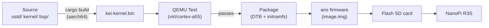
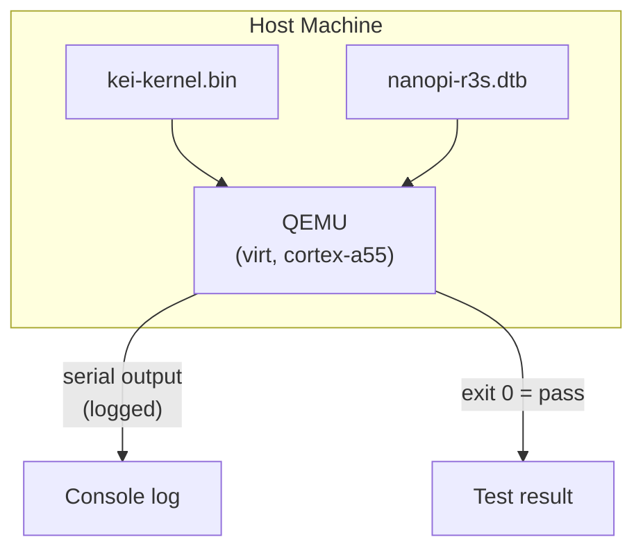
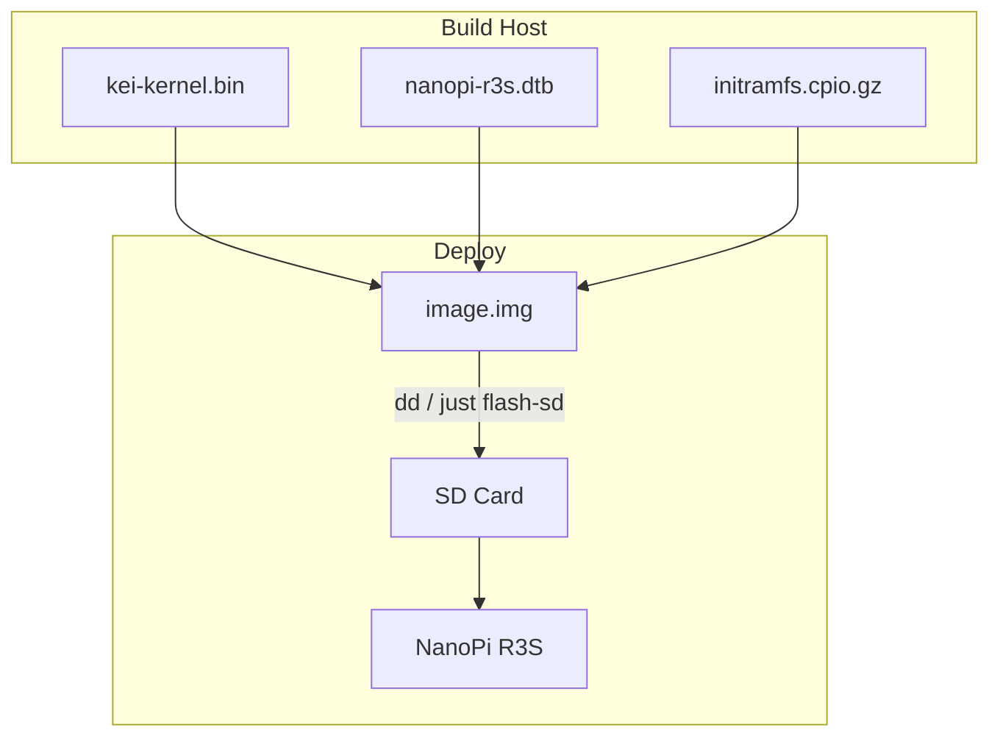
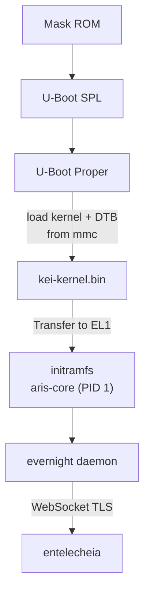

# kei Building & Deploying

## Overview

kei produces `kei-kernel.bin` — the ARM64-enabled Asterinas kernel consumed by
[aris](https://github.com/celestia-island/aris). This guide covers building the
kernel, testing in QEMU, and deploying to physical hardware.

## Build Pipeline



## Prerequisites

- **Host**: Linux x86_64 or ARM64
- **Rust**: 1.85+ with `aarch64-unknown-none-softfloat` target
- **QEMU**: ≥ 8.0 for virt machine with cortex-a55
- **just**: `cargo install just`

## Quick Build

```bash
# One-time setup
just setup        # Configure git remotes and Rust targets

# Sync upstream sources
just vendor       # Absorb latest upstream asterinas (squash)
just pull-arm64   # Pull ARM64 code from wanywhn fork (one-time)
just versions     # Show upstream baseline versions

# Build for the NanoPi R3S
just build        # Builds kei-kernel.bin for aarch64/armv8

# Run QEMU boot tests
just test-all     # Boot-tests all supported architectures
```

## Cross-Compilation

For cross-compiling from x86_64 to aarch64:

```bash
# Add the ARM64 target (one-time)
rustup target add aarch64-unknown-none-softfloat

# Install GCC cross-toolchain (distribution-dependent)
# Ubuntu / Debian:
sudo apt install gcc-aarch64-linux-gnu binutils-aarch64-linux-gnu

# Build
cargo build --release --target aarch64-unknown-none-softfloat \
  -p kei-kernel
```

The kernel binary is a raw ARM64 Image (Linux boot protocol), not an ELF. It
boots directly from U-Boot via the `booti` command.

## QEMU Testing

Test the kernel in QEMU before deploying to hardware:



### Test Matrix

| QEMU Machine | CPU | RAM | Status | Command |
|-------------|-----|-----|--------|---------|
| virt | cortex-a55 | 2GB | ✅ Primary | `just test` |
| virt | cortex-a72 | 2GB | 🔲 Planned | — |
| virt | max | 4GB | 🔲 Planned | — |
| sbsa-ref | max | 4GB | 🔲 Planned | — |

```bash
# Run the primary test target
just test

# Manual QEMU invocation
qemu-system-aarch64 \
  -machine virt,gic-version=3 \
  -cpu cortex-a55 \
  -m 2G \
  -kernel output/kei-kernel.bin \
  -nographic
```

## Physical Deployment

### NanoPi R3S

Deploying kei to a physical NanoPi R3S:



### Flash to SD Card

```bash
# Build the complete firmware image (includes kei-kernel.bin)
# Run from aris repository — aris packages kei as a submodule/dependency
just build-board nanopi-r3s

# Flash to SD card
sudo dd if=output/nanopi-r3s/image.img of=/dev/sdX bs=4M status=progress
sync
```

### Boot Verification

After inserting the SD card and powering on, connect via USB-TTL serial
(1500000 baud, 8N1):

```
U-Boot 2024.01 (Jan 01 2024 - 00:00:00 +0000)
...
## Loading kernel from mmc 0:1
   Image Name:   kei-kernel
   Image Type:   AArch64 Linux Kernel Image
   Data Size:    4194304 Bytes = 4 MiB
   Load Address: 00000000
   Entry Point:  00000000
## Flattened Device Tree blob at 44000000
   Booting using the fdt blob at 0x44000000

kei-kernel booting...
[KEI] initialising GICv3...
[KEI] initialising ARM Generic Timer...
[KEI] starting SMP...
[KEI] 4 cores online
...
aris-core v0.1.0 starting...
evernight daemon starting...
```

### Boot Order



## Integration with aris

kei delivers the kernel binary; aris packages it into a bootable image:

```
aris repository                     kei repository
─────────────────                   ─────────────────
packages/core/        supervisor    kernel/          kernel source
packages/builder/     image builder ostd/            core infra
overlay/              rootfs files  bsp/             board support
scripts/              build + flash board/           board configs
│                                    │
│  just build-board                  │  just build
│    ├── cross-compile aris-core     │    └── cargo build (aarch64)
│    ├── fetch kei-kernel.bin        │
│    ├── assemble image.img          │
│    └── just flash-sd /dev/sdX      │
```

Validate the integration:

```bash
# In aris repo: build with kei kernel
just build-board nanopi-r3s

# Boot in QEMU with the full image
just test-qemu

# Verify kei kernel version in boot log
grep "kei-kernel" output/boot.log
```

## Troubleshooting

| Symptom | Likely Cause | Action |
|---------|-------------|--------|
| No serial output | Wrong baud rate | Use 1500000, not 115200 |
| GICv3 init failed | QEMU machine type | Use `virt,gic-version=3` |
| SMP failed | Missing PSCI in DTB | Check `/cpus` node in device tree |
| Kernel panic | LLM-generated code artifact | Audit `ostd/src/arch/aarch64/` |
| U-Boot can't find kernel | Wrong partition offset | Verify offset in `boot.scr` |
| evernight can't connect | Network not configured | Check `/data/network.toml` |
