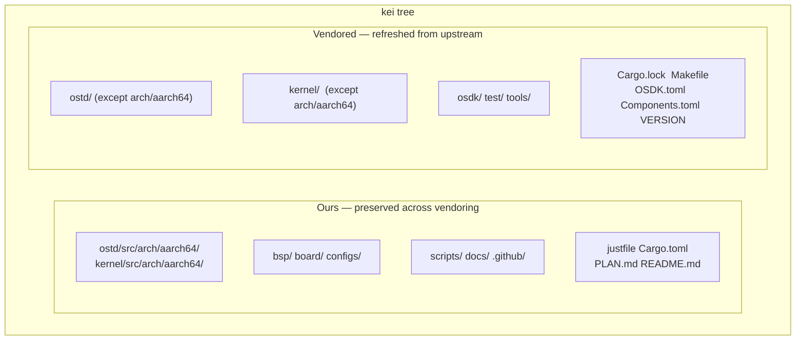
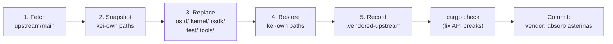

# kei Upstream Sync (Vendoring)

## Overview

kei is an **independent fork** of [asterinas/asterinas](https://github.com/asterinas/asterinas).
It does **not** track upstream with `git merge`. Instead it periodically absorbs
upstream changes through **squash vendoring** — the same model Apple uses for its
LLVM fork. This guide explains why, what gets synced, and exactly how to run an
upstream sync.

## Why Not `git merge`?

kei's dev branch shares **no git ancestry** with `upstream/main` — this is
intentional, not an oversight:

```bash
$ git merge-base dev upstream/main
fatal: not a single merge base  # ← expected
```

| Approach | Verdict | Reason |
|----------|---------|--------|
| `git merge` tracking | ❌ | The 4475-line ARM64 arch port makes every merge conflict-heavy and expensive |
| Patch series (quilt) | ❌ | Fragile at this scale, no IDE support |
| **Independent fork + squash vendor** | ✅ | Full control; absorb upstream on our schedule; conflicts resolved once at vendor time |

The cost of this model: `git log` / `git blame` cannot trace a file's history
across a vendor boundary (each absorption is squashed into one commit). This is
accepted in exchange for cheap, predictable upstream absorption.

## What Is Ours vs. What Is Vendored



| Path | Origin | On `just vendor` |
|------|--------|------------------|
| `ostd/src/arch/aarch64/` | wanywhn fork (PR #3270) | **Preserved** (ours) |
| `kernel/src/arch/aarch64/` | wanywhn fork (PR #3270) | **Preserved** (ours) |
| `bsp/` `board/` `configs/` | kei | **Preserved** (ours) |
| `scripts/` `docs/` `.github/` | kei | **Preserved** (ours) |
| `ostd/` (rest) | upstream | Replaced wholesale |
| `kernel/` (rest) | upstream | Replaced wholesale |
| `osdk/` `test/` `tools/` | upstream | Replaced wholesale |
| `Cargo.lock` `Makefile` `OSDK.toml` `Components.toml` `VERSION` | upstream | Replaced (`Cargo.toml` is merged, not replaced) |

## How Vendoring Works (5 Steps)

`scripts/vendor_upstream.py` performs directory-level replacement, **not** a git
merge. The full process:



1. **Fetch** — `git fetch upstream main` (or a pinned ref).
2. **Snapshot** — kei-own paths are copied to a temp dir (symlinks preserved).
3. **Replace** — `ostd/`, `kernel/`, `osdk/`, `test/`, `tools/` are deleted and
   re-checked out from `upstream/main`. Root files (`Cargo.lock`, `Makefile`,
   `OSDK.toml`, `Components.toml`, `VERSION`) are refreshed too.
4. **Restore** — kei-own paths are layered back on top, including the ARM64 arch
   code (`ostd/src/arch/aarch64/`, `kernel/src/arch/aarch64/`).
5. **Record** — `.vendored-upstream` is rewritten with the new upstream SHA, ref,
   date, and vendor timestamp.

The script does **not** auto-commit. After it finishes you must verify, then
commit the result yourself (see [Workflow](#workflow) below).

## Workflow

### Prerequisites

The `upstream` and `arm64` remotes are configured by `just setup`:

```bash
just setup        # Configures git remotes (upstream, arm64) and Rust targets
```

If your environment needs a proxy, set `HTTPS_PROXY` / `HTTP_PROXY` before
running vendor (the scripts read these). To bypass a proxy for GitHub, export
`NO_PROXY='*'`.

### Absorb Upstream (regular sync)

```bash
# 1. Run the vendor (fetches upstream/main, replaces vendored dirs, restores ours)
just vendor

# 2. Show what changed
git status
git diff --stat

# 3. Fix any API breaks caused by upstream changes
cargo check
just test-all

# 4. Commit the result as a single squashed point
git add -A
git commit -m "vendor: absorb asterinas <upstream-sha>"
```

To vendor a specific commit or tag instead of `main`:

```bash
just vendor-ref v0.12.0      # justfile: just vendor-ref <ref>
# or directly:
python3 scripts/vendor_upstream.py <commit-sha-or-tag>
```

### Pull ARM64 Code (one-time, or rare re-sync)

The ARM64 architecture code comes from
[`wanywhn/asterinas`](https://github.com/wanywhn/asterinas) (branch
`arm64-support`, PR asterinas/asterinas#3270). After the first pull it is
maintained independently inside kei.

```bash
just pull-arm64              # one-time snapshot from wanywhn/asterinas
just pull-arm64-ref <ref>    # re-sync to a specific commit (rare)
```

### Inspect Current Baselines

```bash
just versions                # prints .vendored-upstream and .vendored-arm64
```

Example output:

```
=== Upstream asterinas ===
upstream_url=https://github.com/asterinas/asterinas.git
upstream_ref=main
upstream_sha=3a34935ba3ebdfbc96472e992acda5a74d3b9352
upstream_date=2026-07-04 23:08:32 -0700

=== ARM64 source ===
arm64_url=https://github.com/wanywhn/asterinas.git
arm64_ref=arm64-support
arm64_sha=1437f77b69df2f39a3c5faf87ef3b447c03f1cec
arm64_date=2026-05-25 09:13:57 +0800
```

## Resolving API Breaks

Because kei's ARM64 code is maintained independently, an upstream vendor may
change an API that the ARM64 code depends on. The vendor script cannot fix
these automatically — you resolve them manually after step 3 of the workflow:

```bash
cargo check 2>&1 | tee /tmp/vendor-check.log
# Fix each compile error, then:
just test-all
```

Typical breaks and fixes:

| Symptom | Likely Cause | Fix |
|---------|-------------|-----|
| `cannot find type/function X` | Upstream renamed/removed it | Update call sites in `ostd/src/arch/aarch64/`, `kernel/src/arch/aarch64/` |
| `trait bound not satisfied` | Upstream changed a trait signature | Adapt the ARM64 impl to the new signature |
| `unresolved import` | Upstream reorganized a module | Update `use` paths in ARM64 code |
| Link error in `kernel/` | Upstream moved a component | Adjust `Cargo.toml` member list (merged, not replaced) |

Only edit files under `ostd/src/arch/aarch64/`, `kernel/src/arch/aarch64/`,
`bsp/`, `board/`, `configs/`, and the merged `Cargo.toml`. Everything else under
`ostd/`, `kernel/`, `osdk/`, `test/`, `tools/` is upstream-owned — do not patch
it in place, or your change will be lost on the next vendor.

## When to Vendor

- **Routine**: every 3–6 months, to pick up upstream fixes and features in batch.
- **Critical fix**: when a specific upstream commit is needed sooner (vendor a
  pinned ref with `just vendor-ref <sha>`).

There is no continuous upstream tracking — that is the point of this model.

## Verification Checklist

After a vendor run, before committing:

- [ ] `git diff --stat` shows changes **only** under `ostd/`, `kernel/`, `osdk/`,
      `test/`, `tools/`, root files, and `.vendored-upstream`.
- [ ] `bsp/`, `board/`, `configs/`, `scripts/`, `docs/`, `.github/` are
      **unchanged**.
- [ ] `ostd/src/arch/aarch64/` and `kernel/src/arch/aarch64/` are intact (ours).
- [ ] `cargo check` passes (or all breaks are fixed).
- [ ] `just test-all` boots the aarch64 target in QEMU.
- [ ] `.vendored-upstream` reflects the new upstream SHA.

## See Also

- [Building & Deploying](./deployment.md)
- [ARM64 Support Status](../arm64-status.md)
- [Board Support Package Guide](../bsp-guide.md)
