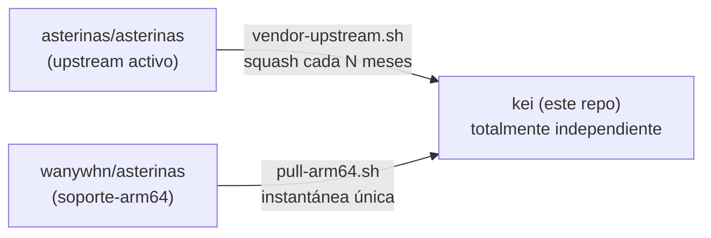

<p align="center"></p>

<h1 align="center">KEI</h1>

<p align="center"><strong>Un núcleo de SO orientado a IoT — disciplina RTOS sobre Asterinas, con acceso al ecosistema Linux</strong></p>

<div align="center">

[](../../LICENSE)
[](../../LICENSE-MPL)
[](https://github.com/celestia-island/kei/actions/workflows/ci.yml)

</div>

<div align="center">

[English](../en/README.md) ·
[简体中文](../zhs/README.md) ·
[繁體中文](../zht/README.md) ·
[日本語](../ja/README.md) ·
[한국어](../ko/README.md) ·
[Français](../fr/README.md) ·
**[Español](../es/README.md)** ·
[Русский](../ru/README.md) ·
[العربية](../ar/README.md)

</div>

## Introducción

KEI es un núcleo de sistema operativo diseñado específicamente para el IoT
industrial. Toma Asterinas y lo conforma en una instalación de estilo RTOS —
pequeño, en tiempo real, auditable — pero mantiene un puente hacia el ecosistema
Linux para que los controladores, herramientas y binarios existentes sigan al
alcance. No es ni una distribución Linux ni Asterinas sin modificar. El análogo
más cercano es un RTOS que resulta hablar Linux: determinismo en tiempo real
para la carga de trabajo que lo necesita, compatibilidad de software de grado
Linux para todo lo demás.

## Modelo de fork

KEI **no** es una rama que sigue al upstream. Es un fork independiente que
absorbe periódicamente los cambios del upstream a su propio ritmo — el mismo
modelo que Apple usa para su fork de LLVM.



KEI mantiene de forma independiente `ostd/src/arch/aarch64/`, `kernel/src/arch/aarch64/`,
`bsp/`, `board/`, `configs/`, y `docs/`.

## Inicio rápido

```bash
just setup        # Configure git remotes
just vendor       # Absorb latest upstream asterinas (squash)
just pull-arm64   # Pull ARM64 code from wanywhn fork (one-time)
just versions     # Show what upstream versions we're based on
just build        # Build kernel for nanopi-r3s (aarch64)
just test-all     # Boot-test all architectures in QEMU
```

## Qué hay dónde

| Directorio | Origen | Mantenimiento |
|------------|--------|---------------|
| `ostd/` | Asterinas upstream | Integrado periódicamente, bugs corregidos in situ |
| `ostd/src/arch/aarch64/` | Fork wanywhn (PR #3270) | **Independiente** — nos pertenece |
| `kernel/` | Asterinas upstream | Integrado periódicamente |
| `kernel/src/arch/aarch64/` | Fork wanywhn (PR #3270) | **Independiente** — nos pertenece |
| `osdk/` | Asterinas upstream | Integrado periódicamente |
| `bsp/` | kei | **100% nuestro** — Board Support Packages |
| `board/` `configs/` | kei | **100% nuestro** — definiciones de placa |
| `scripts/` `docs/` | kei | **100% nuestro** — herramientas y documentación |

## Arquitecturas soportadas

| Arquitectura | Estado | Test QEMU |
|--------------|--------|-----------|
| x86_64 | Nivel 1 upstream | ✅ q35 |
| aarch64 | Mantenido por kei (desde PR #3270) | ✅ virt/cortex-a55 |
| riscv64 | Nivel 2 upstream | ⚠️ virt/rv64 |
| loongarch64 | Nivel 3 upstream | ⚠️ virt/max |

## Licencia

SySL-1.0 (Synthetic Source License) para el código de KEI — ver [LICENSE](../../LICENSE). El código Asterinas integrado (`ostd/`, `kernel/`, `osdk/`) permanece bajo MPL-2.0 — ver [LICENSE-MPL](../../LICENSE-MPL).
