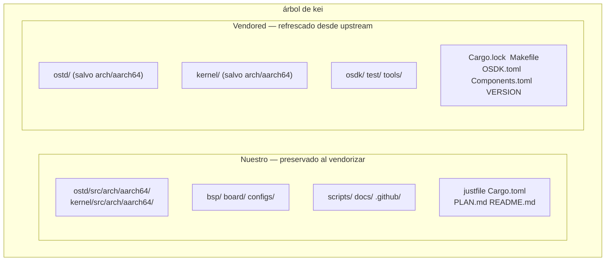
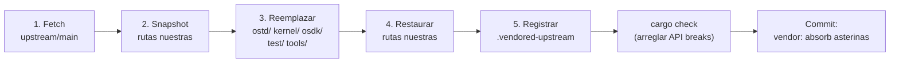

# kei Sincronización con upstream (Vendoring)

## Descripción general

kei es un **fork independiente** de
[asterinas/asterinas](https://github.com/asterinas/asterinas). **No** sigue el
upstream con `git merge`. En su lugar absorbe periódicamente los cambios del
upstream mediante **squash vendoring** — el mismo modelo que Apple usa para su
fork de LLVM. Esta guía explica por qué, qué se sincroniza y cómo ejecutar
exactamente una sincronización con upstream.

## ¿Por qué no `git merge`?

La rama dev de kei **no comparte ninguna ascendencia git** con `upstream/main` —
esto es intencional, no un descuido:

```bash
$ git merge-base dev upstream/main
fatal: not a single merge base  # ← esperado
```

| Enfoque | Veredicto | Razón |
|---------|-----------|-------|
| Seguimiento con `git merge` | ❌ | El puerto de arquitectura ARM64 de 4475 líneas hace que cada merge sea denso en conflictos y costoso |
| Serie de parches (quilt) | ❌ | Frágil a esta escala, sin soporte IDE |
| **Fork independiente + squash vendor** | ✅ | Control total; absorbe el upstream a nuestro ritmo; los conflictos se resuelven una vez en el momento del vendor |

El costo de este modelo: `git log` / `git blame` no pueden rastrear el historial
de un archivo a través de un límite de vendor (cada absorción se squashea en un
único commit). Es el compromiso aceptado a cambio de una absorción del upstream
barata y predecible.

## Qué es nuestro vs. qué es vendored



| Ruta | Origen | Al hacer `just vendor` |
|------|--------|----------------------|
| `ostd/src/arch/aarch64/` | fork wanywhn (PR #3270) | **Preservado** (nuestro) |
| `kernel/src/arch/aarch64/` | fork wanywhn (PR #3270) | **Preservado** (nuestro) |
| `bsp/` `board/` `configs/` | kei | **Preservado** (nuestro) |
| `scripts/` `docs/` `.github/` | kei | **Preservado** (nuestro) |
| `ostd/` (el resto) | upstream | Reemplazo total |
| `kernel/` (el resto) | upstream | Reemplazo total |
| `osdk/` `test/` `tools/` | upstream | Reemplazo total |
| `Cargo.lock` `Makefile` `OSDK.toml` `Components.toml` `VERSION` | upstream | Reemplazados (`Cargo.toml` se fusiona, no se reemplaza) |

## Cómo funciona el vendoring (5 pasos)

`scripts/vendor_upstream.py` realiza un reemplazo a nivel de directorio, **no**
un git merge. Proceso completo:



1. **Fetch** —— `git fetch upstream main` (o un ref fijado).
2. **Snapshot** —— las rutas nuestras se copian a un directorio temporal (los
   enlaces simbólicos se preservan).
3. **Reemplazar** —— `ostd/`, `kernel/`, `osdk/`, `test/`, `tools/` se eliminan y
   se re-checkout desde `upstream/main`. Los archivos raíz (`Cargo.lock`,
   `Makefile`, `OSDK.toml`, `Components.toml`, `VERSION`) también se refrescan.
4. **Restaurar** —— las rutas nuestras se vuelven a superponer, incluido el código
   de arquitectura ARM64 (`ostd/src/arch/aarch64/`, `kernel/src/arch/aarch64/`).
5. **Registrar** —— `.vendored-upstream` se reescribe con el nuevo SHA del
   upstream, ref, fecha y marca de tiempo del vendor.

El script **no** hace commit automáticamente. Al terminar debes verificar y luego
commitar tú mismo (ver [Flujo de trabajo](#flujo-de-trabajo) más abajo).

## Flujo de trabajo

### Requisitos previos

Los remotos `upstream` y `arm64` los configura `just setup`:

```bash
just setup        # Configura los remotos git (upstream, arm64) y los targets de Rust
```

Si tu entorno necesita proxy, define `HTTPS_PROXY` / `HTTP_PROXY` antes de
ejecutar vendor (los scripts los leen). Para que GitHub omita el proxy, exporta
`NO_PROXY='*'`.

### Absorber upstream (sincronización regular)

```bash
# 1. Ejecutar el vendor (hace fetch de upstream/main, reemplaza los dirs vendored, restaura lo nuestro)
just vendor

# 2. Ver qué cambió
git status
git diff --stat

# 3. Corregir cualquier API break causado por cambios del upstream
cargo check
just test-all

# 4. Commitar el resultado como un único punto squasheado
git add -A
git commit -m "vendor: absorb asterinas <upstream-sha>"
```

Para vendorizar un commit o tag específico en lugar de `main`:

```bash
just vendor-ref v0.12.0      # justfile: just vendor-ref <ref>
# o directamente:
python3 scripts/vendor_upstream.py <commit-sha-or-tag>
```

### Obtener el código ARM64 (una sola vez, o resincronización rara)

El código de arquitectura ARM64 viene de
[`wanywhn/asterinas`](https://github.com/wanywhn/asterinas) (rama `arm64-support`,
PR asterinas/asterinas#3270). Tras la primera obtención se mantiene de forma
independiente dentro de kei.

```bash
just pull-arm64              # snapshot único desde wanywhn/asterinas
just pull-arm64-ref <ref>    # resincronizar a un commit específico (raro)
```

### Inspeccionar las líneas base actuales

```bash
just versions                # imprime .vendored-upstream y .vendored-arm64
```

Ejemplo de salida:

```
=== Upstream asterinas ===
upstream_url=https://github.com/asterinas/asterinas.git
upstream_ref=main
upstream_sha=3a34935ba3ebdfbc96472e992acda5a74d3b9352
upstream_date=2026-07-04 23:08:32 -0700

=== ARM64 source ===
arm64_url=https://github.com/wanywhn/asterinas.git
arm64_ref=arm64-support
arm64_sha=1437f77b69df2f39a3c5faf87ef3b447c03f1cec
arm64_date=2026-05-25 09:13:57 +0800
```

## Resolver API breaks

Como el código ARM64 de kei se mantiene de forma independiente, un vendor del
upstream puede cambiar una API de la que depende el código ARM64. El script vendor
no puede arreglarlo automáticamente — lo resuelves a mano tras el paso 3 del
flujo:

```bash
cargo check 2>&1 | tee /tmp/vendor-check.log
# Corrige cada error de compilación y luego:
just test-all
```

Breaks típicos y correcciones:

| Síntoma | Causa probable | Corrección |
|---------|----------------|------------|
| `cannot find type/function X` | El upstream renombró/eliminó | Actualizar los puntos de llamada en `ostd/src/arch/aarch64/`, `kernel/src/arch/aarch64/` |
| `trait bound not satisfied` | El upstream cambió una firma de trait | Adaptar el impl ARM64 a la nueva firma |
| `unresolved import` | El upstream reorganizó un módulo | Actualizar las rutas `use` en el código ARM64 |
| Error de enlace en `kernel/` | El upstream movió un componente | Ajustar la lista de miembros de `Cargo.toml` (fusionado, no reemplazado) |

Solo está permitido editar archivos bajo `ostd/src/arch/aarch64/`,
`kernel/src/arch/aarch64/`, `bsp/`, `board/`, `configs/`, y el `Cargo.toml`
fusionado. Todo lo demás bajo `ostd/`, `kernel/`, `osdk/`, `test/`, `tools/` es
propiedad del upstream — no lo parchees in situ, o tu cambio se perderá en el
próximo vendor.

## Cuándo vendorizar

- **Rutinario**: cada 3–6 meses, para tomar en lote correcciones y funcionalidades
  del upstream.
- **Corrección crítica**: cuando un commit específico del upstream hace falta
  antes (vendorizar un ref fijado con `just vendor-ref <sha>`).

No hay seguimiento continuo del upstream — ese es el punto del modelo.

## Lista de verificación

Tras un vendor, antes de commitar:

- [ ] `git diff --stat` muestra cambios **solo** bajo `ostd/`, `kernel/`,
      `osdk/`, `test/`, `tools/`, los archivos raíz y `.vendored-upstream`.
- [ ] `bsp/`, `board/`, `configs/`, `scripts/`, `docs/`, `.github/` están **sin
      cambios**.
- [ ] `ostd/src/arch/aarch64/` y `kernel/src/arch/aarch64/` están intactos
      (nuestros).
- [ ] `cargo check` pasa (o todos los breaks están corregidos).
- [ ] `just test-all` bootea el target aarch64 en QEMU.
- [ ] `.vendored-upstream` refleja el nuevo SHA del upstream.

## Ver también

- [Construcción y despliegue](./deployment.md)
- [Estado del soporte ARM64](../arm64-status.md)
- [Guía de Board Support Package](../bsp-guide.md)
