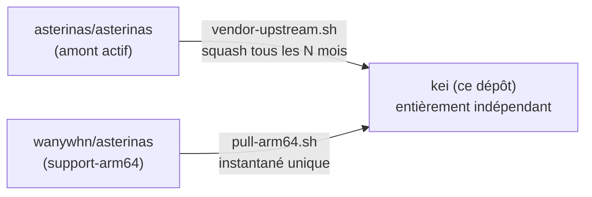

<p align="center"></p>

<h1 align="center">KEI</h1>

<p align="center"><strong>Un noyau OS orienté IoT — discipline RTOS sur Asterinas, avec accès à l'écosystème Linux</strong></p>

<div align="center">

[](../../LICENSE)
[](../../LICENSE-MPL)
[](https://github.com/celestia-island/kei/actions/workflows/ci.yml)

</div>

<div align="center">

[English](../en/README.md) ·
[简体中文](../zhs/README.md) ·
[繁體中文](../zht/README.md) ·
[日本語](../ja/README.md) ·
[한국어](../ko/README.md) ·
**[Français](../fr/README.md)** ·
[Español](../es/README.md) ·
[Русский](../ru/README.md) ·
[العربية](../ar/README.md)

</div>

## Introduction

KEI est un noyau de système d'exploitation conçu spécifiquement pour l'IoT
industriel. Il prend [Asterinas](https://github.com/asterinas/asterinas) et le
façonne en une installation de type RTOS — petit, temps réel, auditable — tout
en conservant un pont vers l'écosystème Linux afin que les pilotes, outils et
binaires existants restent accessibles. Ce n'est ni une distribution Linux ni
un Asterinas standard. L'analogue le plus proche est un RTOS qui se trouve
parler Linux : déterminisme temps réel pour les charges de travail qui en ont
besoin, compatibilité logicielle de niveau Linux pour tout le reste.

## Modèle de fork

KEI n'est **pas** une branche qui suit l'amont. C'est un fork indépendant qui
absorbe périodiquement les changements amont à son propre rythme — le même modèle
qu'Apple utilise pour son fork LLVM.



KEI maintient indépendamment `ostd/src/arch/aarch64/`, `kernel/src/arch/aarch64/`,
`bsp/`, `board/`, `configs/`, et `docs/`.

## Démarrage rapide

```bash
just setup        # Configure git remotes
just vendor       # Absorb latest upstream asterinas (squash)
just pull-arm64   # Pull ARM64 code from wanywhn fork (one-time)
just versions     # Show what upstream versions we're based on
just build        # Build kernel for nanopi-r3s (aarch64)
just test-all     # Boot-test all architectures in QEMU
```

## Ce qui se trouve où

| Répertoire | Origine | Maintenance |
|------------|---------|-------------|
| `ostd/` | Asterinas en amont | Intégré périodiquement, bugs corrigés sur place |
| `ostd/src/arch/aarch64/` | Fork wanywhn (PR #3270) | **Indépendant** — nous en sommes propriétaires |
| `kernel/` | Asterinas en amont | Intégré périodiquement |
| `kernel/src/arch/aarch64/` | Fork wanywhn (PR #3270) | **Indépendant** — nous en sommes propriétaires |
| `osdk/` | Asterinas en amont | Intégré périodiquement |
| `bsp/` | kei | **100% à nous** — Board Support Packages |
| `board/` `configs/` | kei | **100% à nous** — définitions de carte |
| `scripts/` `docs/` | kei | **100% à nous** — outils et documentation |

## Architectures supportées

| Architecture | Statut | Test QEMU |
|--------------|--------|-----------|
| x86_64 | Niveau 1 en amont | ✅ q35 |
| aarch64 | Maintenu par kei (depuis PR #3270) | ✅ virt/cortex-a55 |
| riscv64 | Niveau 2 en amont | ⚠️ virt/rv64 |
| loongarch64 | Niveau 3 en amont | ⚠️ virt/max |

## Licence

SySL-1.0 (Synthetic Source License) pour le code de KEI — voir [LICENSE](../../LICENSE). Le code Asterinas intégré (`ostd/`, `kernel/`, `osdk/`) reste sous MPL-2.0 — voir [LICENSE-MPL](../../LICENSE-MPL).
