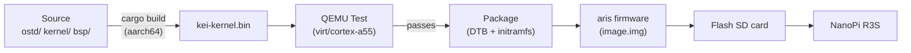
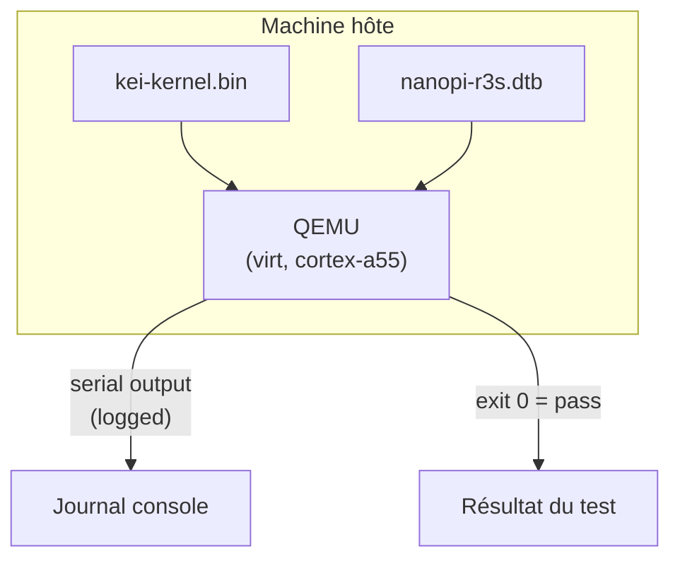
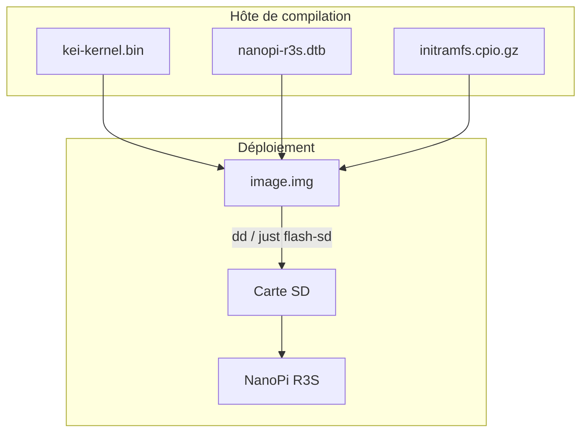
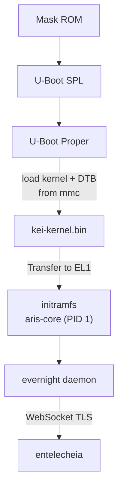

# kei Compilation et déploiement

## Aperçu

kei produit `kei-kernel.bin` — le noyau Asterinas compatible ARM64 consommé
par [aris](https://github.com/celestia-island/aris). Ce guide couvre la
compilation du noyau, les tests dans QEMU et le déploiement sur matériel
physique.

## Pipeline de compilation



## Prérequis

- **Hôte** : Linux x86_64 ou ARM64
- **Rust** : 1.85+ avec la cible `aarch64-unknown-none-softfloat`
- **QEMU** : ≥ 8.0 pour la machine virt avec cortex-a55
- **just** : `cargo install just`

## Compilation rapide

```bash
# One-time setup
just setup        # Configure git remotes and Rust targets

# Sync upstream sources
just vendor       # Absorb latest upstream asterinas (squash)
just pull-arm64   # Pull ARM64 code from wanywhn fork (one-time)
just versions     # Show upstream baseline versions

# Build for the NanoPi R3S
just build        # Builds kei-kernel.bin for aarch64/armv8

# Run QEMU boot tests
just test-all     # Boot-tests all supported architectures
```

## Compilation croisée

Pour la compilation croisée de x86_64 vers aarch64 :

```bash
# Add the ARM64 target (one-time)
rustup target add aarch64-unknown-none-softfloat

# Install GCC cross-toolchain (distribution-dependent)
# Ubuntu / Debian:
sudo apt install gcc-aarch64-linux-gnu binutils-aarch64-linux-gnu

# Build
cargo build --release --target aarch64-unknown-none-softfloat \
  -p kei-kernel
```

Le binaire du noyau est une image ARM64 brute (protocole de démarrage Linux),
pas un ELF. Il démarre directement depuis U-Boot via la commande `booti`.

## Tests QEMU

Testez le noyau dans QEMU avant de déployer sur le matériel :



### Matrice de test

| Machine QEMU | CPU | RAM | État | Commande |
|-------------|-----|-----|--------|---------|
| virt | cortex-a55 | 2GB | ✅ Principal | `just test` |
| virt | cortex-a72 | 2GB | 🔲 Prévu | — |
| virt | max | 4GB | 🔲 Prévu | — |
| sbsa-ref | max | 4GB | 🔲 Prévu | — |

```bash
# Run the primary test target
just test

# Manual QEMU invocation
qemu-system-aarch64 \
  -machine virt,gic-version=3 \
  -cpu cortex-a55 \
  -m 2G \
  -kernel output/kei-kernel.bin \
  -nographic
```

## Déploiement physique

### NanoPi R3S

Déploiement de kei sur un NanoPi R3S physique :



### Flasher sur la carte SD

```bash
# Build the complete firmware image (includes kei-kernel.bin)
# Run from aris repository — aris packages kei as a submodule/dependency
just build-board nanopi-r3s

# Flash to SD card
sudo dd if=output/nanopi-r3s/image.img of=/dev/sdX bs=4M status=progress
sync
```

### Vérification du démarrage

Après avoir inséré la carte SD et mis sous tension, connectez-vous via USB-TTL
série (1500000 bauds, 8N1) :

```
U-Boot 2024.01 (Jan 01 2024 - 00:00:00 +0000)
...
## Loading kernel from mmc 0:1
   Image Name:   kei-kernel
   Image Type:   AArch64 Linux Kernel Image
   Data Size:    4194304 Bytes = 4 MiB
   Load Address: 00000000
   Entry Point:  00000000
## Flattened Device Tree blob at 44000000
   Booting using the fdt blob at 0x44000000

kei-kernel booting...
[KEI] initialising GICv3...
[KEI] initialising ARM Generic Timer...
[KEI] starting SMP...
[KEI] 4 cores online
...
aris-core v0.1.0 starting...
evernight daemon starting...
```

### Ordre de démarrage



## Intégration avec aris

kei fournit le binaire du noyau ; aris l'empaquette dans une image démarrable :

```
aris repository                     kei repository
─────────────────                   ─────────────────
packages/core/        supervisor    kernel/          kernel source
packages/builder/     image builder ostd/            core infra
overlay/              rootfs files  bsp/             board support
scripts/              build + flash board/           board configs
│                                    │
│  just build-board                  │  just build
│    ├── cross-compile aris-core     │    └── cargo build (aarch64)
│    ├── fetch kei-kernel.bin        │
│    ├── assemble image.img          │
│    └── just flash-sd /dev/sdX      │
```

Valider l'intégration :

```bash
# In aris repo: build with kei kernel
just build-board nanopi-r3s

# Boot in QEMU with the full image
just test-qemu

# Verify kei kernel version in boot log
grep "kei-kernel" output/boot.log
```

## Dépannage

| Symptôme | Cause probable | Action |
|---------|-------------|--------|
| Pas de sortie série | Mauvais débit en bauds | Utilisez 1500000, pas 115200 |
| Échec d'initialisation GICv3 | Type de machine QEMU | Utilisez `virt,gic-version=3` |
| Échec SMP | PSCI manquant dans le DTB | Vérifiez le nœud `/cpus` dans le device tree |
| Kernel panic | Artefact de code généré par LLM | Auditez `ostd/src/arch/aarch64/` |
| U-Boot ne trouve pas le noyau | Offset de partition incorrect | Vérifiez l'offset dans `boot.scr` |
| evernight ne peut pas se connecter | Réseau non configuré | Vérifiez `/data/network.toml` |
