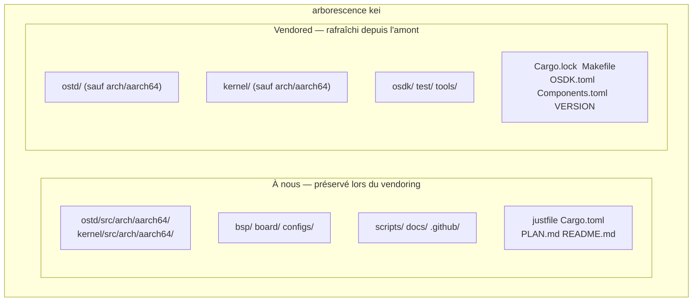
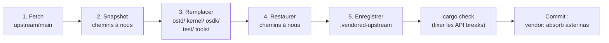

# kei Synchronisation amont (Vendoring)

## Aperçu

kei est un **fork indépendant** de
[asterinas/asterinas](https://github.com/asterinas/asterinas). Il **ne** suit
**pas** l'amont avec `git merge`. Il absorbe périodiquement les changements
amont via du **squash vendoring** — le même modèle qu'Apple utilise pour son
fork LLVM. Ce guide explique pourquoi, ce qui est synchronisé, et comment
exécuter précisément une synchronisation amont.

## Pourquoi pas `git merge` ?

La branche dev de kei ne partage **aucune ascendance git** avec `upstream/main`
— c'est intentionnel, pas un oubli :

```bash
$ git merge-base dev upstream/main
fatal: not a single merge base  # ← attendu
```

| Approche | Verdict | Raison |
|----------|---------|--------|
| Suivi par `git merge` | ❌ | Le port d'architecture ARM64 de 4475 lignes rend chaque merge lourd en conflits et coûteux |
| Série de patches (quilt) | ❌ | Fragile à cette échelle, sans support IDE |
| **Fork indépendant + squash vendor** | ✅ | Contrôle total ; absorbe l'amont à notre rythme ; conflits résolus une fois au moment du vendor |

Le coût de ce modèle : `git log` / `git blame` ne peuvent pas tracer l'historique
d'un fichier à travers une limite de vendor (chaque absorption est squasée en un
seul commit). C'est le compromis accepté en échange d'une absorption amont
bon marché et prévisible.

## Ce qui est à nous vs. ce qui est vendored



| Chemin | Origine | Lors du `just vendor` |
|--------|---------|----------------------|
| `ostd/src/arch/aarch64/` | fork wanywhn (PR #3270) | **Préservé** (à nous) |
| `kernel/src/arch/aarch64/` | fork wanywhn (PR #3270) | **Préservé** (à nous) |
| `bsp/` `board/` `configs/` | kei | **Préservé** (à nous) |
| `scripts/` `docs/` `.github/` | kei | **Préservé** (à nous) |
| `ostd/` (le reste) | amont | Remplacé globalement |
| `kernel/` (le reste) | amont | Remplacé globalement |
| `osdk/` `test/` `tools/` | amont | Remplacé globalement |
| `Cargo.lock` `Makefile` `OSDK.toml` `Components.toml` `VERSION` | amont | Remplacé (`Cargo.toml` est fusionné, pas remplacé) |

## Comment fonctionne le vendoring (5 étapes)

`scripts/vendor_upstream.py` effectue un remplacement au niveau répertoire, **pas**
un git merge. Processus complet :



1. **Fetch** —— `git fetch upstream main` (ou un ref épinglé).
2. **Snapshot** —— les chemins à nous sont copiés vers un répertoire temporaire
   (liens symboliques préservés).
3. **Remplacer** —— `ostd/`, `kernel/`, `osdk/`, `test/`, `tools/` sont supprimés
   et re-checkout depuis `upstream/main`. Les fichiers racine (`Cargo.lock`,
   `Makefile`, `OSDK.toml`, `Components.toml`, `VERSION`) sont aussi rafraîchis.
4. **Restaurer** —— les chemins à nous sont reposés par-dessus, y compris le code
   d'architecture ARM64 (`ostd/src/arch/aarch64/`, `kernel/src/arch/aarch64/`).
5. **Enregistrer** —— `.vendored-upstream` est réécrit avec le nouveau SHA amont,
   le ref, la date et l'horodatage du vendor.

Le script ne fait **pas** de commit automatique. Une fois terminé, vous devez
vérifier puis commiter vous-même (voir [Flux de travail](#flux-de-travail)
ci-dessous).

## Flux de travail

### Prérequis

Les remotes `upstream` et `arm64` sont configurées par `just setup` :

```bash
just setup        # Configure les remotes git (upstream, arm64) et les cibles Rust
```

Si votre environnement nécessite un proxy, définissez `HTTPS_PROXY` /
`HTTP_PROXY` avant de lancer vendor (les scripts les lisent). Pour court-circuiter
le proxy pour GitHub, exportez `NO_PROXY='*'`.

### Absorber l'amont (synchro régulière)

```bash
# 1. Lancer le vendor (fetch upstream/main, remplace les répertoires vendored, restaure notre code)
just vendor

# 2. Voir ce qui a changé
git status
git diff --stat

# 3. Corriger les éventuelles API breaks dues aux changements amont
cargo check
just test-all

# 4. Commiter le résultat comme un seul point squasé
git add -A
git commit -m "vendor: absorb asterinas <upstream-sha>"
```

Pour vendor un commit ou un tag spécifique au lieu de `main` :

```bash
just vendor-ref v0.12.0      # justfile : just vendor-ref <ref>
# ou directement :
python3 scripts/vendor_upstream.py <commit-sha-or-tag>
```

### Récupérer le code ARM64 (ponctuel, ou resync rare)

Le code d'architecture ARM64 vient de
[`wanywhn/asterinas`](https://github.com/wanywhn/asterinas) (branche
`arm64-support`, PR asterinas/asterinas#3270). Après la première récupération, il
est maintenu indépendamment dans kei.

```bash
just pull-arm64              # snapshot ponctuel depuis wanywhn/asterinas
just pull-arm64-ref <ref>    # resync vers un commit spécifique (rare)
```

### Inspecter les lignes de base actuelles

```bash
just versions                # affiche .vendored-upstream et .vendored-arm64
```

Exemple de sortie :

```
=== Upstream asterinas ===
upstream_url=https://github.com/asterinas/asterinas.git
upstream_ref=main
upstream_sha=3a34935ba3ebdfbc96472e992acda5a74d3b9352
upstream_date=2026-07-04 23:08:32 -0700

=== ARM64 source ===
arm64_url=https://github.com/wanywhn/asterinas.git
arm64_ref=arm64-support
arm64_sha=1437f77b69df2f39a3c5faf87ef3b447c03f1cec
arm64_date=2026-05-25 09:13:57 +0800
```

## Résoudre les API breaks

Le code ARM64 de kei étant maintenu indépendamment, un vendor amont peut changer
une API dont dépend le code ARM64. Le script vendor ne peut pas corriger cela
automatiquement — vous le résolvez manuellement après l'étape 3 du flux :

```bash
cargo check 2>&1 | tee /tmp/vendor-check.log
# Corrigez chaque erreur de compilation, puis :
just test-all
```

Breaks typiques et corrections :

| Symptôme | Cause probable | Correction |
|----------|----------------|------------|
| `cannot find type/function X` | L'amont a renommé/supprimé | Mettre à jour les sites d'appel dans `ostd/src/arch/aarch64/`, `kernel/src/arch/aarch64/` |
| `trait bound not satisfied` | L'amont a changé une signature de trait | Adapter l'impl ARM64 à la nouvelle signature |
| `unresolved import` | L'amont a réorganisé un module | Mettre à jour les chemins `use` dans le code ARM64 |
| Erreur de lien dans `kernel/` | L'amont a déplacé un composant | Ajuster la liste des membres de `Cargo.toml` (fusionné, pas remplacé) |

Ne modifiez que les fichiers sous `ostd/src/arch/aarch64/`,
`kernel/src/arch/aarch64/`, `bsp/`, `board/`, `configs/`, et le `Cargo.toml`
fusionné. Tout le reste sous `ostd/`, `kernel/`, `osdk/`, `test/`, `tools/`
appartient à l'amont — ne le patchez pas en place, sinon votre changement sera
perdu au prochain vendor.

## Quand vendor

- **Routine** : tous les 3 à 6 mois, pour récupérer en lot les correctifs et
  fonctionnalités amont.
- **Correctif critique** : lorsqu'un commit amont spécifique est nécessaire plus
  tôt (vendor d'un ref épinglé avec `just vendor-ref <sha>`).

Il n'y a pas de suivi amont continu — c'est tout l'intérêt du modèle.

## Liste de vérification

Après un vendor, avant de commiter :

- [ ] `git diff --stat` ne montre des changements **que** sous `ostd/`,
      `kernel/`, `osdk/`, `test/`, `tools/`, les fichiers racine, et
      `.vendored-upstream`.
- [ ] `bsp/`, `board/`, `configs/`, `scripts/`, `docs/`, `.github/` sont
      **inchangés**.
- [ ] `ostd/src/arch/aarch64/` et `kernel/src/arch/aarch64/` sont intacts (à
      nous).
- [ ] `cargo check` passe (ou tous les breaks sont corrigés).
- [ ] `just test-all` boote la cible aarch64 dans QEMU.
- [ ] `.vendored-upstream` reflète le nouveau SHA amont.

## Voir aussi

- [Compilation et déploiement](./deployment.md)
- [Statut du support ARM64](../arm64-status.md)
- [Guide des Board Support Packages](../bsp-guide.md)
