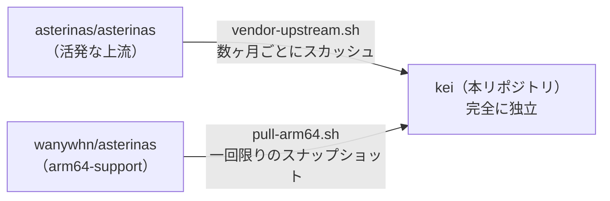

<p align="center"></p>

<h1 align="center">KEI</h1>

<p align="center"><strong>IoT 向け OS カーネル — Asterinas 上の RTOS 規律、Linux エコシステムへのアクセス付き</strong></p>

<div align="center">

[](../../LICENSE)
[](../../LICENSE-MPL)
[](https://github.com/celestia-island/kei/actions/workflows/ci.yml)

</div>

<div align="center">

[English](../en/README.md) ·
[简体中文](../zhs/README.md) ·
[繁體中文](../zht/README.md) ·
**日本語** ·
[한국어](../ko/README.md) ·
[Français](../fr/README.md) ·
[Español](../es/README.md) ·
[Русский](../ru/README.md) ·
[العربية](../ar/README.md)

</div>

## はじめに

KEI は産業用 IoT のために専用構築された OS カーネルです。[asterinas/asterinas](https://github.com/asterinas/asterinas) を取り込み、それを RTOS 風の施設へと形作ります —— 小さく、リアルタイムで、監査可能 —— 一方で Linux エコシステムへの橋を保ち、既存のドライバ、ツール、バイナリが手の届く範囲に残るようにします。Linux ディストリビューションでも、ストックの Asterinas でもありません。最も近い類似物は、たまたま Linux を話す RTOS です。必要なワークロードにはリアルタイムの決定性を、それ以外のすべてには Linux グレードのソフトウェア互換性を提供します。

## フォークモデル

KEI は上流を追跡するブランチでは**ありません**。独立したフォークであり、独自のスケジュールで
定期的に上流の変更を取り込みます —— Apple が自社の LLVM フォークで採用しているモデルと同じです。



KEI は `ostd/src/arch/aarch64/`、`kernel/src/arch/aarch64/`、
`bsp/`、`board/`、`configs/`、`docs/` を独自に保守しています。

## クイックスタート

```bash
just setup        # Configure git remotes
just vendor       # Absorb latest upstream asterinas (squash)
just pull-arm64   # Pull ARM64 code from wanywhn fork (one-time)
just versions     # Show what upstream versions we're based on
just build        # Build kernel for nanopi-r3s (aarch64)
just test-all     # Boot-test all architectures in QEMU
```

## 各ディレクトリの役割

| ディレクトリ | 由来 | 保守 |
|-----------|--------|-------------|
| `ostd/` | 上流 asterinas | 定期的にベンダー取り込み、バグはその場で修正 |
| `ostd/src/arch/aarch64/` | wanywhn フォーク（PR #3270） | **独立** —— 私たちが管理 |
| `kernel/` | 上流 asterinas | 定期的にベンダー取り込み |
| `kernel/src/arch/aarch64/` | wanywhn フォーク（PR #3270） | **独立** —— 私たちが管理 |
| `osdk/` | 上流 asterinas | 定期的にベンダー取り込み |
| `bsp/` | kei | **100% 自作** —— ボードサポートパッケージ |
| `board/` `configs/` | kei | **100% 自作** —— ボード定義 |
| `scripts/` `docs/` | kei | **100% 自作** —— ツールとドキュメント |

## サポートするアーキテクチャ

| アーキテクチャ | 状態 | QEMU テスト |
|------|--------|-----------|
| x86_64 | 上流 Tier 1 | ✅ q35 |
| aarch64 | kei 保守（PR #3270 由来） | ✅ virt/cortex-a55 |
| riscv64 | 上流 Tier 2 | ⚠️ virt/rv64 |
| loongarch64 | 上流 Tier 3 | ⚠️ virt/max |

## ライセンス

SySL-1.0（Synthetic Source License）が KEI 自身のコードに適用されます —— [LICENSE](../../LICENSE) を参照。ベンダー取り込みの Asterinas コード（`ostd/`、`kernel/`、`osdk/`）は MPL-2.0 のままです —— [LICENSE-MPL](../../LICENSE-MPL) を参照。
