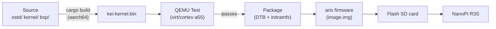
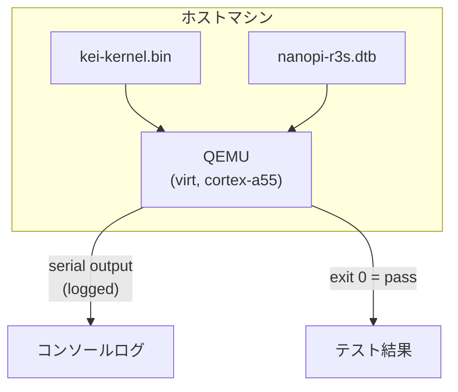
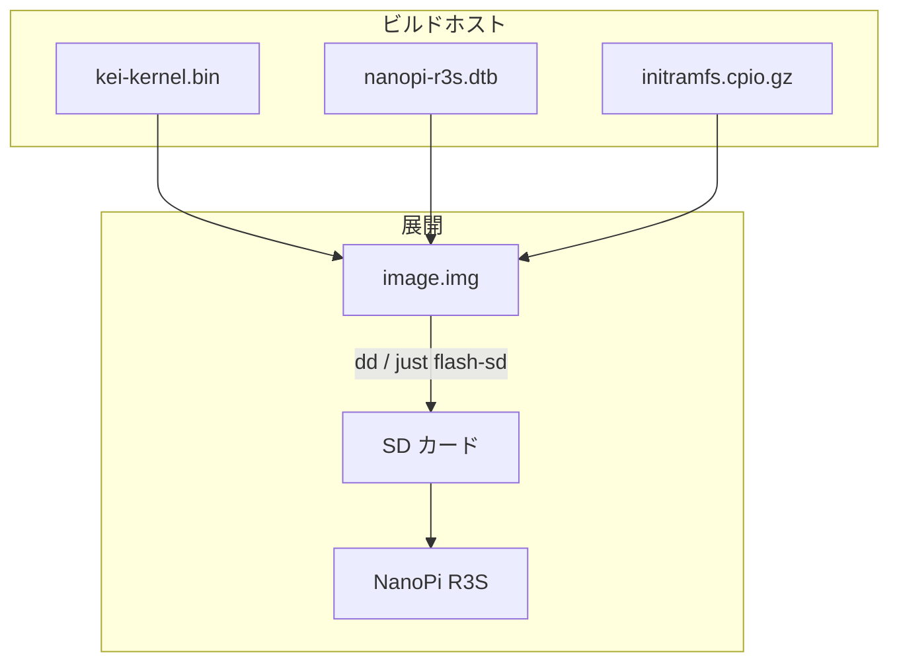
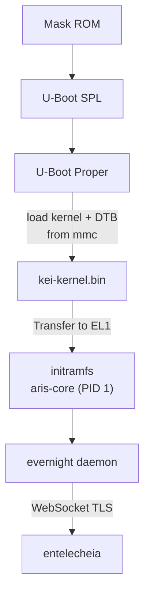

# kei ビルドとデプロイ

## 概要

kei は `kei-kernel.bin` — [aris](https://github.com/celestia-island/aris)
が使用する ARM64 対応 Asterinas カーネルを生成します。このガイドでは、
カーネルのビルド、QEMU でのテスト、物理ハードウェアへの展開を説明します。

## ビルドパイプライン



## 前提条件

- **ホスト**: Linux x86_64 または ARM64
- **Rust**: 1.85+、`aarch64-unknown-none-softfloat` ターゲット付き
- **QEMU**: ≥ 8.0、cortex-a55 搭載 virt マシン用
- **just**: `cargo install just`

## クイックビルド

```bash
# One-time setup
just setup        # Configure git remotes and Rust targets

# Sync upstream sources
just vendor       # Absorb latest upstream asterinas (squash)
just pull-arm64   # Pull ARM64 code from wanywhn fork (one-time)
just versions     # Show upstream baseline versions

# Build for the NanoPi R3S
just build        # Builds kei-kernel.bin for aarch64/armv8

# Run QEMU boot tests
just test-all     # Boot-tests all supported architectures
```

## クロスコンパイル

x86_64 から aarch64 へのクロスコンパイルの場合：

```bash
# Add the ARM64 target (one-time)
rustup target add aarch64-unknown-none-softfloat

# Install GCC cross-toolchain (distribution-dependent)
# Ubuntu / Debian:
sudo apt install gcc-aarch64-linux-gnu binutils-aarch64-linux-gnu

# Build
cargo build --release --target aarch64-unknown-none-softfloat \
  -p kei-kernel
```

カーネルバイナリは生の ARM64 Image（Linux ブートプロトコル）であり、ELF
ではありません。U-Boot から `booti` コマンドで直接起動します。

## QEMU テスト

ハードウェアに展開する前に、QEMU でカーネルをテストします：



### テストマトリックス

| QEMU マシン | CPU | RAM | 状態 | コマンド |
|-------------|-----|-----|--------|---------|
| virt | cortex-a55 | 2GB | ✅ 主要 | `just test` |
| virt | cortex-a72 | 2GB | 🔲 予定 | — |
| virt | max | 4GB | 🔲 予定 | — |
| sbsa-ref | max | 4GB | 🔲 予定 | — |

```bash
# Run the primary test target
just test

# Manual QEMU invocation
qemu-system-aarch64 \
  -machine virt,gic-version=3 \
  -cpu cortex-a55 \
  -m 2G \
  -kernel output/kei-kernel.bin \
  -nographic
```

## 物理展開

### NanoPi R3S

kei を物理 NanoPi R3S に展開する：



### SD カードへの書き込み

```bash
# Build the complete firmware image (includes kei-kernel.bin)
# Run from aris repository — aris packages kei as a submodule/dependency
just build-board nanopi-r3s

# Flash to SD card
sudo dd if=output/nanopi-r3s/image.img of=/dev/sdX bs=4M status=progress
sync
```

### 起動検証

SD カードを挿入して電源を投入した後、USB-TTL シリアル（1500000 ボー、
8N1）で接続します：

```
U-Boot 2024.01 (Jan 01 2024 - 00:00:00 +0000)
...
## Loading kernel from mmc 0:1
   Image Name:   kei-kernel
   Image Type:   AArch64 Linux Kernel Image
   Data Size:    4194304 Bytes = 4 MiB
   Load Address: 00000000
   Entry Point:  00000000
## Flattened Device Tree blob at 44000000
   Booting using the fdt blob at 0x44000000

kei-kernel booting...
[KEI] initialising GICv3...
[KEI] initialising ARM Generic Timer...
[KEI] starting SMP...
[KEI] 4 cores online
...
aris-core v0.1.0 starting...
evernight daemon starting...
```

### 起動順序



## aris との統合

kei はカーネルバイナリを提供し、aris はそれを起動可能なイメージにパッケージ
します：

```
aris repository                     kei repository
─────────────────                   ─────────────────
packages/core/        supervisor    kernel/          kernel source
packages/builder/     image builder ostd/            core infra
overlay/              rootfs files  bsp/             board support
scripts/              build + flash board/           board configs
│                                    │
│  just build-board                  │  just build
│    ├── cross-compile aris-core     │    └── cargo build (aarch64)
│    ├── fetch kei-kernel.bin        │
│    ├── assemble image.img          │
│    └── just flash-sd /dev/sdX      │
```

統合の検証：

```bash
# In aris repo: build with kei kernel
just build-board nanopi-r3s

# Boot in QEMU with the full image
just test-qemu

# Verify kei kernel version in boot log
grep "kei-kernel" output/boot.log
```

## トラブルシューティング

| 症状 | 考えられる原因 | 対処 |
|---------|-------------|--------|
| シリアル出力なし | ボーレートが間違っている | 115200 ではなく 1500000 を使用 |
| GICv3 初期化失敗 | QEMU マシン種別 | `virt,gic-version=3` を使用 |
| SMP 失敗 | DTB に PSCI がない | デバイスツリーの `/cpus` ノードを確認 |
| Kernel panic | LLM 生成コードの不具合 | `ostd/src/arch/aarch64/` を監査 |
| U-Boot がカーネルを見つけられない | パーティションオフセットが間違い | `boot.scr` のオフセットを確認 |
| evernight が接続できない | ネットワーク未設定 | `/data/network.toml` を確認 |
