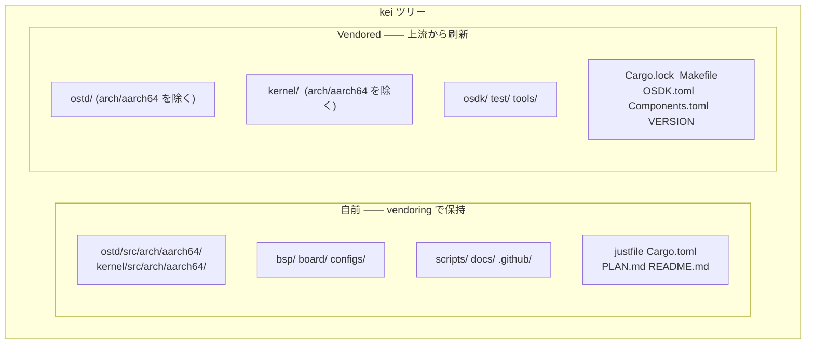
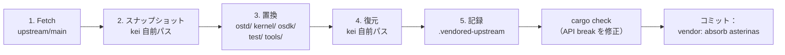

# kei 上流同期（Vendoring）

## 概要

kei は [asterinas/asterinas](https://github.com/asterinas/asterinas) の**独立な
フォーク**です。`git merge` で上流を追跡することは**なく**、周期的に **squash
vendoring** で上流の変更を取り込みます —— Apple が自社の LLVM フォークを保守
するのと同じモデルです。本ガイドではその理由、同期の範囲、上流同期を実行する
正確な手順を説明します。

## なぜ `git merge` しないのか？

kei の dev ブランチは `upstream/main` と**git 上の共通祖先を持ちません** ——
これは意図的なもので、見落録ではありません：

```bash
$ git merge-base dev upstream/main
fatal: not a single merge base  # ← 期待どおり
```

| 方式 | 判定 | 理由 |
|------|------|------|
| `git merge` で追跡 | ❌ | 4475 行の ARM64 アーキテクチャ移植により、毎回の merge が衝突だらけで高コスト |
| パッチ系列（quilt） | ❌ | この規模では脆弱、IDE 支援なし |
| **独立フォーク + squash vendor** | ✅ | 完全な制御、自分のペースで上流を取り込み、衝突は vendor 時に一回で解決 |

このモデルの代償：vendor 境界をまたいだ `git log` / `git blame` によるファイル
履歴追跡はできません（各取り込みは単一コミットに squash されます）。これは、
安価で予測可能な上流取り込みと引き換えに受け入れるトレードオフです。

## 自前のものと vendored なもの



| パス | 由来 | `just vendor` 時 |
|------|------|------------------|
| `ostd/src/arch/aarch64/` | wanywhn フォーク (PR #3270) | **保持**（自前） |
| `kernel/src/arch/aarch64/` | wanywhn フォーク (PR #3270) | **保持**（自前） |
| `bsp/` `board/` `configs/` | kei | **保持**（自前） |
| `scripts/` `docs/` `.github/` | kei | **保持**（自前） |
| `ostd/`（その他） | 上流 | 全体置換 |
| `kernel/`（その他） | 上流 | 全体置換 |
| `osdk/` `test/` `tools/` | 上流 | 全体置換 |
| `Cargo.lock` `Makefile` `OSDK.toml` `Components.toml` `VERSION` | 上流 | 置換（`Cargo.toml` は置換而非マージ） |

## Vendoring の仕組み（5 ステップ）

`scripts/vendor_upstream.py` が行うのはディレクトリ単位の置換で、git merge
では**ありません**。完全な流れ：



1. **Fetch** —— `git fetch upstream main`（または pin した ref）。
2. **スナップショット** —— kei 自前パスを一時ディレクトリにコピー（シンボリック
   リンクを保持）。
3. **置換** —— `ostd/`、`kernel/`、`osdk/`、`test/`、`tools/` を削除し、
   `upstream/main` から再 checkout。ルートファイル（`Cargo.lock`、`Makefile`、
   `OSDK.toml`、`Components.toml`、`VERSION`）も更新。
4. **復元** —— kei 自前パスを上に重ねる。ARM64 アーキテクチャコード
   （`ostd/src/arch/aarch64/`、`kernel/src/arch/aarch64/`）を含む。
5. **記録** —— `.vendored-upstream` を新しい上流 SHA、ref、日付、vendor
   タイムスタンプで書き直す。

スクリプトは**自動ではコミットしません**。終わった後、自分で検証してコミット
してください（下記の[ワークフロー](#ワークフロー)を参照）。

## ワークフロー

### 前提条件

`just setup` が `upstream` と `arm64` リモートを設定します：

```bash
just setup        # git リモート（upstream、arm64）と Rust ターゲットを設定
```

環境がプロキシを必要とする場合、vendor 実行前に `HTTPS_PROXY` / `HTTP_PROXY`
を設定してください（スクリプトが読みます）。GitHub をプロキシから外すには
`NO_PROXY='*'` を export します。

### 上流の取り込み（定期同期）

```bash
# 1. vendor を実行（upstream/main を fetch、vendored ディレクトリを置換、自前コードを復元）
just vendor

# 2. 変更を確認
git status
git diff --stat

# 3. 上流の変更で起きた API break を修正
cargo check
just test-all

# 4. 単一の squash コミットとして確定
git add -A
git commit -m "vendor: absorb asterinas <upstream-sha>"
```

`main` ではなく特定の commit や tag を vendor する：

```bash
just vendor-ref v0.12.0      # justfile: just vendor-ref <ref>
# または直接：
python3 scripts/vendor_upstream.py <commit-sha-or-tag>
```

### ARM64 コードの取得（一回のみ、または稀な再同期）

ARM64 アーキテクチャコードは
[`wanywhn/asterinas`](https://github.com/wanywhn/asterinas)（ブランチ
`arm64-support`、PR asterinas/asterinas#3270）由来です。最初の取得後は kei 内で
独立に保守されます。

```bash
just pull-arm64              # wanywhn/asterinas から一回限りのスナップショット
just pull-arm64-ref <ref>    # 特定の commit に再同期（稀）
```

### 現在のベースラインを確認

```bash
just versions                # .vendored-upstream と .vendored-arm64 を表示
```

出力例：

```
=== Upstream asterinas ===
upstream_url=https://github.com/asterinas/asterinas.git
upstream_ref=main
upstream_sha=3a34935ba3ebdfbc96472e992acda5a74d3b9352
upstream_date=2026-07-04 23:08:32 -0700

=== ARM64 source ===
arm64_url=https://github.com/wanywhn/asterinas.git
arm64_ref=arm64-support
arm64_sha=1437f77b69df2f39a3c5faf87ef3b447c03f1cec
arm64_date=2026-05-25 09:13:57 +0800
```

## API break の解決

kei の ARM64 コードは独立に保守されているため、上流の vendor が ARM64 コードが
依存する API を変更する可能性があります。vendor スクリプトはこれを自動修正でき
ません —— ワークフローのステップ 3 の後に手動で解決します：

```bash
cargo check 2>&1 | tee /tmp/vendor-check.log
# 各コンパイルエラーを修正してから：
just test-all
```

典型的な break と修正：

| 症状 | おそらく原因 | 修正 |
|------|--------------|------|
| `cannot find type/function X` | 上流が改名/削除 | `ostd/src/arch/aarch64/`、`kernel/src/arch/aarch64/` の呼び出し点を更新 |
| `trait bound not satisfied` | 上流が trait シグネチャを変更 | ARM64 の実装を新しいシグネチャに適合 |
| `unresolved import` | 上流がモジュールを再編 | ARM64 コードの `use` パスを更新 |
| `kernel/` のリンクエラー | 上流がコンポーネントを移動 | `Cargo.toml` のメンバーリストを調整（マージ、非置換） |

編集してよいのは `ostd/src/arch/aarch64/`、`kernel/src/arch/aarch64/`、
`bsp/`、`board/`、`configs/`、およびマージ後の `Cargo.toml` だけです。
`ostd/`、`kernel/`、`osdk/`、`test/`、`tools/` 配下のその他はすべて上流所有
です —— その場でパッチしないでください。さもないと次回の vendor で失われます。

## いつ vendor するか

- **定期**: 3〜6 か月ごと。上流の修正や機能をバッチで取り込むため。
- **重要な修正**: 特定の上流 commit が早く必要になった場合、pin して vendor
  （`just vendor-ref <sha>`）。

継続的な上流追跡はありません —— それがこのモデルの要点です。

## 検証チェックリスト

vendor 実行後、コミットする前に：

- [ ] `git diff --stat` の変更が**のみ** `ostd/`、`kernel/`、`osdk/`、
      `test/`、`tools/`、ルートファイル、`.vendored-upstream` に現れている。
- [ ] `bsp/`、`board/`、`configs/`、`scripts/`、`docs/`、`.github/` は
      **変更されていない**。
- [ ] `ostd/src/arch/aarch64/` と `kernel/src/arch/aarch64/` が無傷（自前）。
- [ ] `cargo check` が通る（または break をすべて修正済み）。
- [ ] `just test-all` が QEMU で aarch64 ターゲットを起動できる。
- [ ] `.vendored-upstream` が新しい上流 SHA を反映している。

## 関連項目

- [ビルドとデプロイ](./deployment.md)
- [ARM64 サポート状況](../arm64-status.md)
- [ボードサポートパッケージガイド](../bsp-guide.md)
