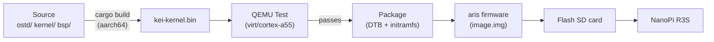
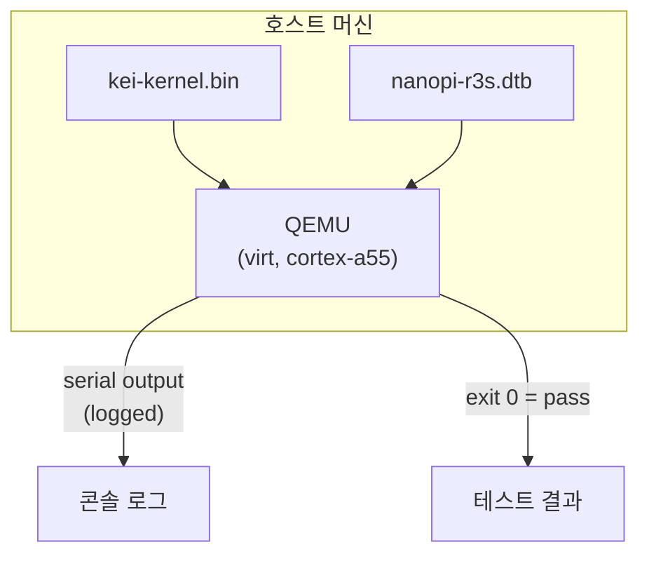
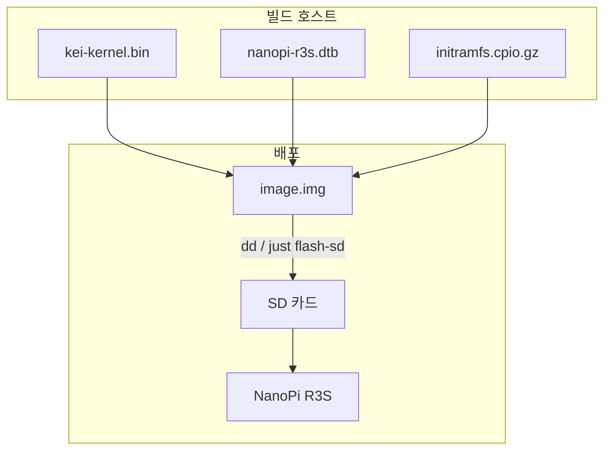
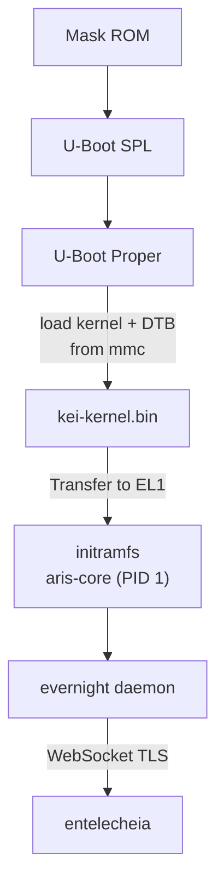

# kei 빌드 및 배포

## 개요

kei는 `kei-kernel.bin` — [aris](https://github.com/celestia-island/aris)가
사용하는 ARM64 지원 Asterinas 커널을 생성합니다. 이 가이드는 커널 빌드,
QEMU 테스트 및 물리적 하드웨어 배포를 다룹니다.

## 빌드 파이프라인



## 사전 요구 사항

- **호스트**: Linux x86_64 또는 ARM64
- **Rust**: 1.85+, `aarch64-unknown-none-softfloat` 타겟 포함
- **QEMU**: ≥ 8.0, cortex-a55 용 virt 머신
- **just**: `cargo install just`

## 빠른 빌드

```bash
# One-time setup
just setup        # Configure git remotes and Rust targets

# Sync upstream sources
just vendor       # Absorb latest upstream asterinas (squash)
just pull-arm64   # Pull ARM64 code from wanywhn fork (one-time)
just versions     # Show upstream baseline versions

# Build for the NanoPi R3S
just build        # Builds kei-kernel.bin for aarch64/armv8

# Run QEMU boot tests
just test-all     # Boot-tests all supported architectures
```

## 크로스 컴파일

x86_64에서 aarch64로 크로스 컴파일하는 경우:

```bash
# Add the ARM64 target (one-time)
rustup target add aarch64-unknown-none-softfloat

# Install GCC cross-toolchain (distribution-dependent)
# Ubuntu / Debian:
sudo apt install gcc-aarch64-linux-gnu binutils-aarch64-linux-gnu

# Build
cargo build --release --target aarch64-unknown-none-softfloat \
  -p kei-kernel
```

커널 바이너리는 ELF가 아닌 원시 ARM64 Image(Linux 부트 프로토콜)입니다.
U-Boot에서 `booti` 명령을 통해 직접 부팅합니다.

## QEMU 테스트

하드웨어에 배포하기 전에 QEMU에서 커널을 테스트합니다:



### 테스트 매트릭스

| QEMU 머신 | CPU | RAM | 상태 | 명령 |
|-------------|-----|-----|--------|---------|
| virt | cortex-a55 | 2GB | ✅ 주 | `just test` |
| virt | cortex-a72 | 2GB | 🔲 예정 | — |
| virt | max | 4GB | 🔲 예정 | — |
| sbsa-ref | max | 4GB | 🔲 예정 | — |

```bash
# Run the primary test target
just test

# Manual QEMU invocation
qemu-system-aarch64 \
  -machine virt,gic-version=3 \
  -cpu cortex-a55 \
  -m 2G \
  -kernel output/kei-kernel.bin \
  -nographic
```

## 물리적 배포

### NanoPi R3S

kei를 물리적 NanoPi R3S에 배포하기:



### SD 카드에 플래시

```bash
# Build the complete firmware image (includes kei-kernel.bin)
# Run from aris repository — aris packages kei as a submodule/dependency
just build-board nanopi-r3s

# Flash to SD card
sudo dd if=output/nanopi-r3s/image.img of=/dev/sdX bs=4M status=progress
sync
```

### 부트 검증

SD 카드를 삽입하고 전원을 켠 후, USB-TTL 시리얼(1500000 보드, 8N1)로
연결합니다:

```
U-Boot 2024.01 (Jan 01 2024 - 00:00:00 +0000)
...
## Loading kernel from mmc 0:1
   Image Name:   kei-kernel
   Image Type:   AArch64 Linux Kernel Image
   Data Size:    4194304 Bytes = 4 MiB
   Load Address: 00000000
   Entry Point:  00000000
## Flattened Device Tree blob at 44000000
   Booting using the fdt blob at 0x44000000

kei-kernel booting...
[KEI] initialising GICv3...
[KEI] initialising ARM Generic Timer...
[KEI] starting SMP...
[KEI] 4 cores online
...
aris-core v0.1.0 starting...
evernight daemon starting...
```

### 부트 순서



## aris와의 통합

kei는 커널 바이너리를 제공하고, aris는 이를 부팅 가능한 이미지로 패키징
합니다:

```
aris repository                     kei repository
─────────────────                   ─────────────────
packages/core/        supervisor    kernel/          kernel source
packages/builder/     image builder ostd/            core infra
overlay/              rootfs files  bsp/             board support
scripts/              build + flash board/           board configs
│                                    │
│  just build-board                  │  just build
│    ├── cross-compile aris-core     │    └── cargo build (aarch64)
│    ├── fetch kei-kernel.bin        │
│    ├── assemble image.img          │
│    └── just flash-sd /dev/sdX      │
```

통합 검증:

```bash
# In aris repo: build with kei kernel
just build-board nanopi-r3s

# Boot in QEMU with the full image
just test-qemu

# Verify kei kernel version in boot log
grep "kei-kernel" output/boot.log
```

## 문제 해결

| 증상 | 가능한 원인 | 조치 |
|---------|-------------|--------|
| 시리얼 출력 없음 | 잘못된 보레이트 | 115200 대신 1500000 사용 |
| GICv3 초기화 실패 | QEMU 머신 유형 | `virt,gic-version=3` 사용 |
| SMP 실패 | DTB에 PSCI 누락 | 디바이스 트리의 `/cpus` 노드 확인 |
| Kernel panic | LLM 생성 코드 아티팩트 | `ostd/src/arch/aarch64/` 감사 |
| U-Boot가 커널을 찾을 수 없음 | 잘못된 파티션 오프셋 | `boot.scr`의 오프셋 확인 |
| evernight 연결 불가 | 네트워크 미설정 | `/data/network.toml` 확인 |
