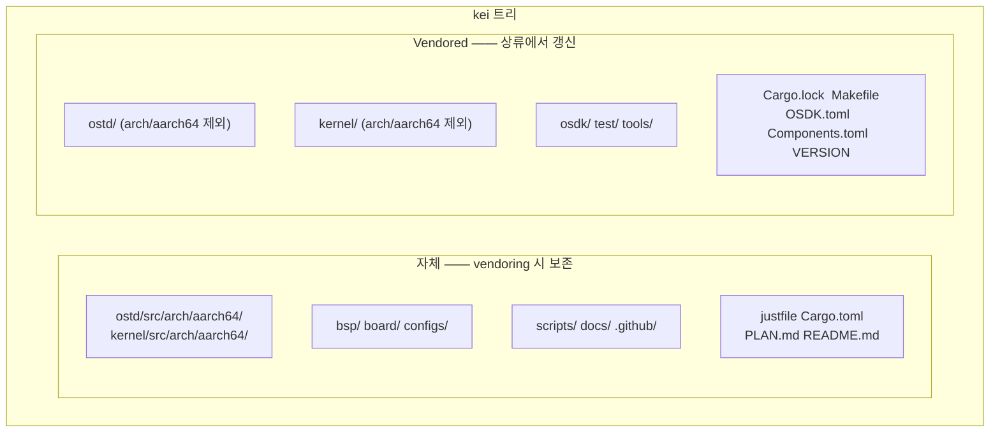
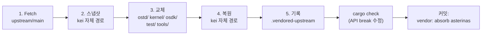

# kei 상游 동기화(Vendoring)

## 개요

kei는 [asterinas/asterinas](https://github.com/asterinas/asterinas)의 **독립
포크**입니다. `git merge`로 상류를 추적하지 **않으며**, 대신 주기적으로
**squash vendoring**으로 상류 변경 사항을 흡수합니다 —— Apple이 자사 LLVM 포크를
유지하는 것과 동일한 모델입니다. 이 가이드는 그 이유, 동기화 범위, 그리고 상류
동기화를 정확히 실행하는 방법을 설명합니다.

## 왜 `git merge`가 아닌가?

kei의 dev 브랜치는 `upstream/main`과 **git 공통 조상이 전혀 없습니다** —— 이는
의도적인 것이며 누락이 아닙니다:

```bash
$ git merge-base dev upstream/main
fatal: not a single merge base  # ← 예상된 동작
```

| 방식 | 판정 | 이유 |
|------|------|------|
| `git merge` 추적 | ❌ | 4475줄의 ARM64 아키텍처 포트 때문에 매번 merge가 충돌 투성이고 비용이 큼 |
| 패치 시리즈(quilt) | ❌ | 이 규모에서는 깨지기 쉽고 IDE 지원 없음 |
| **독립 포크 + squash vendor** | ✅ | 완전한 제어, 자신의 일정에 따라 상류를 흡수, 충돌은 vendor 시점에 한 번에 해결 |

이 모델의 대가: vendor 경계를 가로질러 `git log` / `git blame`으로 파일 이력을
추적할 수 없습니다(각 흡수는 단일 커밋으로 squash됨). 이는 저렴하고 예측 가능한
상류 흡수와 맞바꿔 받아들인 트레이드오프입니다.

## 자체 코드와 vendored 코드



| 경로 | 출처 | `just vendor` 시 |
|------|------|------------------|
| `ostd/src/arch/aarch64/` | wanywhn 포크 (PR #3270) | **보존**(자체) |
| `kernel/src/arch/aarch64/` | wanywhn 포크 (PR #3270) | **보존**(자체) |
| `bsp/` `board/` `configs/` | kei | **보존**(자체) |
| `scripts/` `docs/` `.github/` | kei | **보존**(자체) |
| `ostd/`(나머지) | 상류 | 전체 교체 |
| `kernel/`(나머지) | 상류 | 전체 교체 |
| `osdk/` `test/` `tools/` | 상류 | 전체 교체 |
| `Cargo.lock` `Makefile` `OSDK.toml` `Components.toml` `VERSION` | 상류 | 교체(`Cargo.toml`은 교체가 아닌 병합) |

## Vendoring 작동 방식(5단계)

`scripts/vendor_upstream.py`는 디렉터리 수준 교체를 수행하며, git merge가
**아닙니다**. 전체 과정:



1. **Fetch** —— `git fetch upstream main`(또는 pin한 ref).
2. **스냅샷** —— kei 자체 경로를 임시 디렉터리로 복사(심볼릭 링크 보존).
3. **교체** —— `ostd/`, `kernel/`, `osdk/`, `test/`, `tools/`를 삭제하고
   `upstream/main`에서 다시 checkout. 루트 파일(`Cargo.lock`, `Makefile`,
   `OSDK.toml`, `Components.toml`, `VERSION`)도 갱신.
4. **복원** —— kei 자체 경로를 위에 다시 얹음. ARM64 아키텍처 코드
   (`ostd/src/arch/aarch64/`, `kernel/src/arch/aarch64/`) 포함.
5. **기록** —— `.vendored-upstream`을 새 상류 SHA, ref, 날짜, vendor 타임스탬프로
   다시 작성.

스크립트는 **자동으로 커밋하지 않습니다**. 끝난 뒤 직접 검증하고 커밋해야
합니다(아래 [워크플로](#워크플로) 참조).

## 워크플로

### 전제 조건

`just setup`이 `upstream`과 `arm64` 리모트를 구성합니다:

```bash
just setup        # git 리모트(upstream, arm64)와 Rust 타깃 구성
```

환경이 프록시를 필요로 한다면, vendor 실행 전에 `HTTPS_PROXY` / `HTTP_PROXY`를
설정하세요(스크립트가 읽습니다). GitHub를 프록시에서 제외하려면 `NO_PROXY='*'`를
export 하세요.

### 상류 흡수(정기 동기화)

```bash
# 1. vendor 실행(upstream/main을 fetch, vendored 디렉터리 교체, 자체 코드 복원)
just vendor

# 2. 변경 사항 확인
git status
git diff --stat

# 3. 상류 변경으로 인한 API break 수정
cargo check
just test-all

# 4. 단일 squash 커밋으로 확정
git add -A
git commit -m "vendor: absorb asterinas <upstream-sha>"
```

`main` 대신 특정 commit이나 tag를 vendor 하려면:

```bash
just vendor-ref v0.12.0      # justfile: just vendor-ref <ref>
# 또는 직접:
python3 scripts/vendor_upstream.py <commit-sha-or-tag>
```

### ARM64 코드 가져오기(일회성, 또는 드문 재동기화)

ARM64 아키텍처 코드는
[`wanywhn/asterinas`](https://github.com/wanywhn/asterinas)(브랜치
`arm64-support`, PR asterinas/asterinas#3270)에서 옵니다. 최초 가져오기 이후
kei 내에서 독립적으로 유지됩니다.

```bash
just pull-arm64              # wanywhn/asterinas에서 일회성 스냅샷
just pull-arm64-ref <ref>    # 특정 commit으로 재동기화(드묾)
```

### 현재 베이스라인 확인

```bash
just versions                # .vendored-upstream과 .vendored-arm64 출력
```

출력 예:

```
=== Upstream asterinas ===
upstream_url=https://github.com/asterinas/asterinas.git
upstream_ref=main
upstream_sha=3a34935ba3ebdfbc96472e992acda5a74d3b9352
upstream_date=2026-07-04 23:08:32 -0700

=== ARM64 source ===
arm64_url=https://github.com/wanywhn/asterinas.git
arm64_ref=arm64-support
arm64_sha=1437f77b69df2f39a3c5faf87ef3b447c03f1cec
arm64_date=2026-05-25 09:13:57 +0800
```

## API break 해결

kei의 ARM64 코드는 독립적으로 유지되므로, 상류 vendor가 ARM64 코드가 의존하는
API를 변경할 수 있습니다. vendor 스크립트는 이를 자동 수정할 수 없습니다 ——
워크플로 3단계 이후에 수동으로 해결합니다:

```bash
cargo check 2>&1 | tee /tmp/vendor-check.log
# 각 컴파일 에러를 수정한 뒤:
just test-all
```

전형적인 break와 수정:

| 증상 | 추정 원인 | 수정 |
|------|----------|------|
| `cannot find type/function X` | 상류가 이름 변경/제거 | `ostd/src/arch/aarch64/`, `kernel/src/arch/aarch64/`의 호출 지점 갱신 |
| `trait bound not satisfied` | 상류가 trait 시그니처 변경 | ARM64 구현을 새 시그니처에 맞게 조정 |
| `unresolved import` | 상류가 모듈 재조직 | ARM64 코드의 `use` 경로 갱신 |
| `kernel/` 링크 에러 | 상류가 컴포넌트 이동 | `Cargo.toml` 멤버 목록 조정(교체가 아닌 병합) |

수정이 허용된 곳은 `ostd/src/arch/aarch64/`, `kernel/src/arch/aarch64/`,
`bsp/`, `board/`, `configs/`, 그리고 병합된 `Cargo.toml`뿐입니다.
`ostd/`, `kernel/`, `osdk/`, `test/`, `tools/` 아래의 나머지는 모두 상류
소유입니다 —— 그 자리에서 패치하지 마세요. 그렇지 않으면 다음 vendor에서
사라집니다.

## 언제 vendor 할까

- **정기**: 3~6개월마다. 상류의 수정과 기능을 일괄 가져오기 위해.
- **중요 수정**: 특정 상류 commit이 빨리 필요할 때 pin하여 vendor
  (`just vendor-ref <sha>`).

지속적인 상류 추적은 없습니다 —— 이것이 이 모델의 핵심입니다.

## 검증 체크리스트

vendor 실행 후, 커밋 전에:

- [ ] `git diff --stat`의 변경이 **오직** `ostd/`, `kernel/`, `osdk/`,
      `test/`, `tools/`, 루트 파일, `.vendored-upstream`에만 나타난다.
- [ ] `bsp/`, `board/`, `configs/`, `scripts/`, `docs/`, `.github/`가
      **변경되지 않았다**.
- [ ] `ostd/src/arch/aarch64/`와 `kernel/src/arch/aarch64/`가 무결하다(자체).
- [ ] `cargo check`가 통과한다(또는 모든 break를 수정했다).
- [ ] `just test-all`이 QEMU에서 aarch64 타깃을 부트한다.
- [ ] `.vendored-upstream`이 새 상류 SHA를 반영한다.

## 함께 보기

- [빌드 및 배포](./deployment.md)
- [ARM64 지원 현황](../arm64-status.md)
- [보드 지원 패키지 가이드](../bsp-guide.md)
