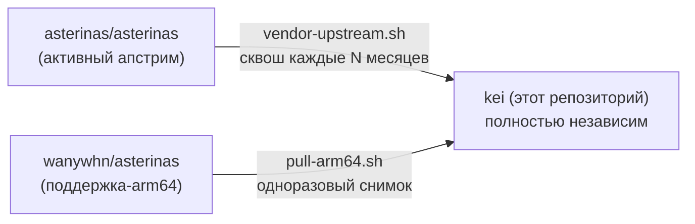

<p align="center"></p>

<h1 align="center">KEI</h1>

<p align="center"><strong>IoT-ориентированное ядро ОС — RTOS-дисциплина на Asterinas с доступом к экосистеме Linux</strong></p>

<div align="center">

[](../../LICENSE)
[](../../LICENSE-MPL)
[](https://github.com/celestia-island/kei/actions/workflows/ci.yml)

</div>

<div align="center">

[English](../en/README.md) ·
[简体中文](../zhs/README.md) ·
[繁體中文](../zht/README.md) ·
[日本語](../ja/README.md) ·
[한국어](../ko/README.md) ·
[Français](../fr/README.md) ·
[Español](../es/README.md) ·
**[Русский](../ru/README.md)** ·
[العربية](../ar/README.md)

</div>

## Введение

KEI — это ядро операционной системы, специально созданное для промышленного IoT.
Оно берёт [Asterinas](https://github.com/asterinas/asterinas) и превращает её в
средство в стиле RTOS — компактное, работающее в реальном времени, аудируемое —
но сохраняет мост в экосистему Linux, чтобы существующие драйверы, инструменты и
бинарники оставались в пределах досягаемости. Это ни дистрибутив Linux, ни штатная
Asterinas. Ближайший аналог — RTOS, которая случаем говорит на Linux: детерминизм
реального времени для нагрузки, которой он нужен, и программная совместимость
уровня Linux для всего остального.

## Модель форка

KEI **не** является веткой, отслеживающей апстрим. Это независимый форк, который
периодически включает изменения апстрима по своему графику — та же модель, которую
Apple использует для своего форка LLVM.



KEI самостоятельно поддерживает `ostd/src/arch/aarch64/`, `kernel/src/arch/aarch64/`,
`bsp/`, `board/`, `configs/` и `docs/`.

## Быстрый старт

```bash
just setup        # Configure git remotes
just vendor       # Absorb latest upstream asterinas (squash)
just pull-arm64   # Pull ARM64 code from wanywhn fork (one-time)
just versions     # Show what upstream versions we're based on
just build        # Build kernel for nanopi-r3s (aarch64)
just test-all     # Boot-test all architectures in QEMU
```

## Что где находится

| Каталог | Происхождение | Поддержка |
|---------|---------------|-----------|
| `ostd/` | Апстрим asterinas | Периодический вендоринг, баги исправляются на месте |
| `ostd/src/arch/aarch64/` | Форк wanywhn (PR #3270) | **Независимо** — принадлежит нам |
| `kernel/` | Апстрим asterinas | Периодический вендоринг |
| `kernel/src/arch/aarch64/` | Форк wanywhn (PR #3270) | **Независимо** — принадлежит нам |
| `osdk/` | Апстрим asterinas | Периодический вендоринг |
| `bsp/` | kei | **100% наше** — Board Support Packages |
| `board/` `configs/` | kei | **100% наше** — определения плат |
| `scripts/` `docs/` | kei | **100% наше** — инструменты и документация |

## Поддерживаемые архитектуры

| Архитектура | Статус | Тест QEMU |
|-------------|--------|-----------|
| x86_64 | Апстрим, уровень 1 | ✅ q35 |
| aarch64 | Поддерживается kei (из PR #3270) | ✅ virt/cortex-a55 |
| riscv64 | Апстрим, уровень 2 | ⚠️ virt/rv64 |
| loongarch64 | Апстрим, уровень 3 | ⚠️ virt/max |

## Лицензия

SySL-1.0（Synthetic Source License）для собственного кода KEI — см. [LICENSE](../../LICENSE). Вендорный код Asterinas（`ostd/`, `kernel/`, `osdk/`）остаётся под MPL-2.0 — см. [LICENSE-MPL](../../LICENSE-MPL).
