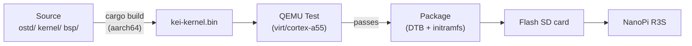
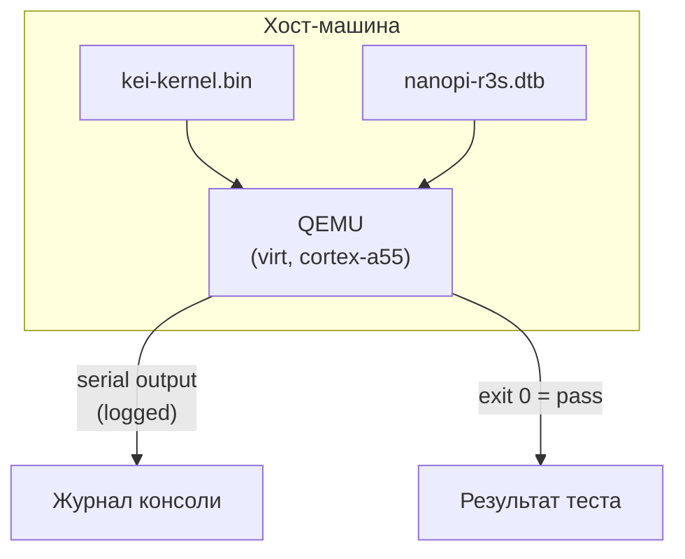
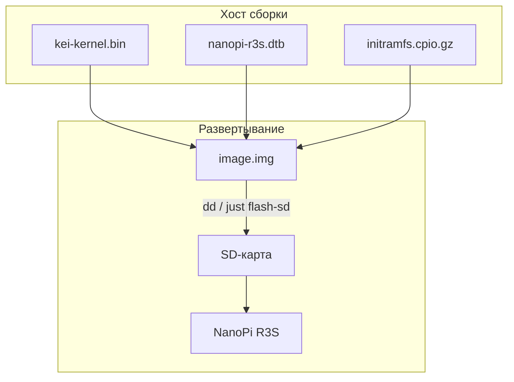
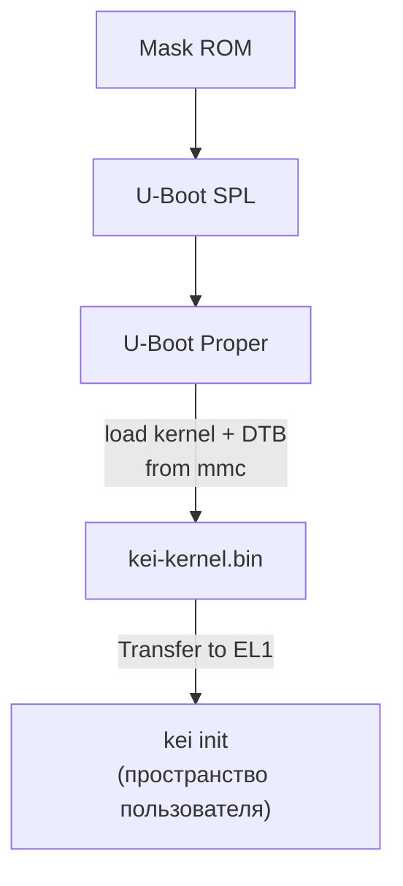

# kei Сборка и развертывание

## Обзор

kei создает `kei-kernel.bin` — ядро Asterinas с поддержкой ARM64. Это
руководство охватывает сборку ядра, тестирование в QEMU и развертывание на
физическом оборудовании.

## Конвейер сборки



## Предварительные требования

- **Хост**: Linux x86_64 или ARM64
- **Rust**: 1.85+ с целью `aarch64-unknown-none-softfloat`
- **QEMU**: ≥ 8.0 для машины virt с cortex-a55
- **just**: `cargo install just`

## Быстрая сборка

```bash
# One-time setup
just setup        # Configure git remotes and Rust targets

# Sync upstream sources
just vendor       # Absorb latest upstream asterinas (squash)
just versions     # Show upstream baseline versions

# Build for the NanoPi R3S
just build        # Builds kei-kernel.bin for aarch64/armv8

# Run QEMU boot tests
just test-all     # Boot-tests all supported architectures
```

## Кросс-компиляция

Для кросс-компиляции с x86_64 на aarch64:

```bash
# Add the ARM64 target (one-time)
rustup target add aarch64-unknown-none-softfloat

# Install GCC cross-toolchain (distribution-dependent)
# Ubuntu / Debian:
sudo apt install gcc-aarch64-linux-gnu binutils-aarch64-linux-gnu

# Build
cargo build --release --target aarch64-unknown-none-softfloat \
  -p kei-kernel
```

Бинарный файл ядра — это сырой образ ARM64 Image (протокол загрузки Linux),
а не ELF. Он загружается непосредственно из U-Boot через команду `booti`.

## Тестирование в QEMU

Протестируйте ядро в QEMU перед развертыванием на оборудовании:



### Матрица тестирования

| Машина QEMU | CPU | RAM | Статус | Команда |
|-------------|-----|-----|--------|---------|
| virt | cortex-a55 | 2GB | ✅ Основной | `just test` |
| virt | cortex-a72 | 2GB | 🔲 Запланирован | — |
| virt | max | 4GB | 🔲 Запланирован | — |
| sbsa-ref | max | 4GB | 🔲 Запланирован | — |

```bash
# Run the primary test target
just test

# Manual QEMU invocation
qemu-system-aarch64 \
  -machine virt,gic-version=3 \
  -cpu cortex-a55 \
  -m 2G \
  -kernel output/kei-kernel.bin \
  -nographic
```

## Физическое развертывание

### NanoPi R3S

Развертывание kei на физическом NanoPi R3S:



### Запись на SD-карту

```bash
# Build the complete firmware image (includes kei-kernel.bin)
just build-board nanopi-r3s

# Flash to SD card
sudo dd if=output/nanopi-r3s/image.img of=/dev/sdX bs=4M status=progress
sync
```

### Проверка загрузки

После установки SD-карты и включения питания подключитесь через USB-TTL
последовательный порт (1500000 бод, 8N1):

```
U-Boot 2024.01 (Jan 01 2024 - 00:00:00 +0000)
...
## Loading kernel from mmc 0:1
   Image Name:   kei-kernel
   Image Type:   AArch64 Linux Kernel Image
   Data Size:    4194304 Bytes = 4 MiB
   Load Address: 00000000
   Entry Point:  00000000
## Flattened Device Tree blob at 44000000
   Booting using the fdt blob at 0x44000000

kei-kernel booting...
[KEI] initialising GICv3...
[KEI] initialising ARM Generic Timer...
[KEI] starting SMP...
[KEI] 4 cores online
...
```

### Порядок загрузки



## Устранение неполадок

| Симптом | Вероятная причина | Действие |
|---------|-------------|--------|
| Нет вывода в последовательный порт | Неверная скорость | Используйте 1500000, а не 115200 |
| Сбой инициализации GICv3 | Тип машины QEMU | Используйте `virt,gic-version=3` |
| Сбой SMP | Отсутствует PSCI в DTB | Проверьте узел `/cpus` в дереве устройств |
| Kernel panic | Ошибка в коде архитектурного слоя | Проверьте `ostd/src/arch/aarch64/` |
| U-Boot не находит ядро | Неверное смещение раздела | Проверьте смещение в `boot.scr` |
