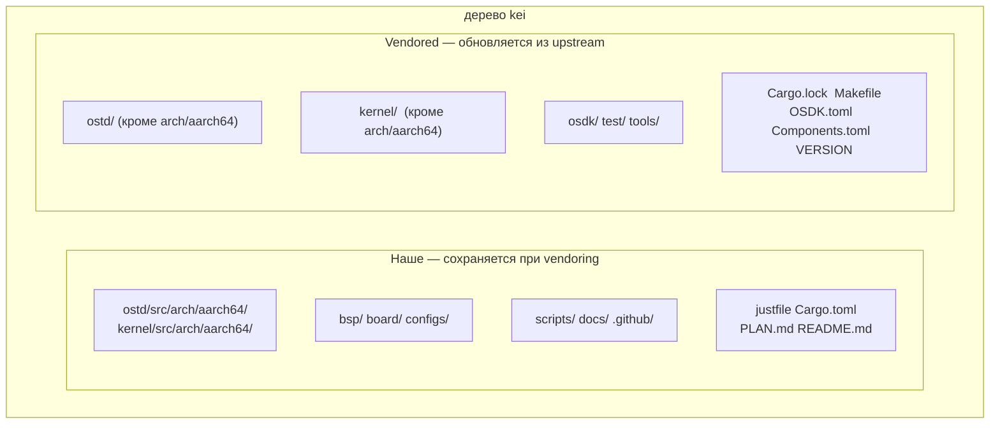
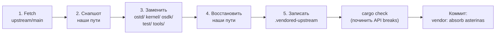

# kei Синхронизация с upstream (Vendoring)

## Обзор

kei — **независимый форк** [asterinas/asterinas](https://github.com/asterinas/asterinas).
Он **не** отслеживает upstream через `git merge`. Вместо этого он периодически
поглощает изменения upstream через **squash vendoring** — ту же модель, которую
Apple использует для своего форка LLVM. Это руководство объясняет почему, что
синхронизируется и как точно выполнить синхронизацию с upstream.

## Почему не `git merge`?

Ветка dev в kei **не имеет общего git-предка** с `upstream/main` — это сделано
намеренно, а не по упущению:

```bash
$ git merge-base dev upstream/main
fatal: not a single merge base  # ← ожидаемо
```

| Подход | Вердикт | Причина |
|--------|---------|---------|
| Отслеживание через `git merge` | ❌ | 4475-строчный порт архитектуры ARM64 делает каждый merge перегруженным конфликтами и дорогим |
| Серия патчей (quilt) | ❌ | Хрупко в таком масштабе, без поддержки IDE |
| **Независимый форк + squash vendor** | ✅ | Полный контроль; поглощаем upstream по своему графику; конфликты разрешаются однократно в момент vendor |

Цена этой модели: `git log` / `git blame` не могут отследить историю файла через
границу vendor (каждое поглощение схлопывается в один коммит). Это компромисс,
принятый ради дешёвого и предсказуемого поглощения upstream.

## Что наше, а что vendored



| Путь | Источник | При `just vendor` |
|------|----------|-------------------|
| `ostd/src/arch/aarch64/` | форк wanywhn (PR #3270) | **Сохраняется** (наше) |
| `kernel/src/arch/aarch64/` | форк wanywhn (PR #3270) | **Сохраняется** (наше) |
| `bsp/` `board/` `configs/` | kei | **Сохраняется** (наше) |
| `scripts/` `docs/` `.github/` | kei | **Сохраняется** (наше) |
| `ostd/` (остальное) | upstream | Полная замена |
| `kernel/` (остальное) | upstream | Полная замена |
| `osdk/` `test/` `tools/` | upstream | Полная замена |
| `Cargo.lock` `Makefile` `OSDK.toml` `Components.toml` `VERSION` | upstream | Заменяются (`Cargo.toml` сливается, а не заменяется) |

## Как работает vendoring (5 шагов)

`scripts/vendor_upstream.py` выполняет замену на уровне каталогов, **а не** git
merge. Полный процесс:



1. **Fetch** —— `git fetch upstream main` (или зафиксированный ref).
2. **Снапшот** —— наши пути копируются во временный каталог (символические ссылки
   сохраняются).
3. **Заменить** —— `ostd/`, `kernel/`, `osdk/`, `test/`, `tools/` удаляются и
   заново checkout-ятся из `upstream/main`. Корневые файлы (`Cargo.lock`,
   `Makefile`, `OSDK.toml`, `Components.toml`, `VERSION`) также обновляются.
4. **Восстановить** —— наши пути накладываются обратно сверху, включая код
   архитектуры ARM64 (`ostd/src/arch/aarch64/`, `kernel/src/arch/aarch64/`).
5. **Записать** —— `.vendored-upstream` перезаписывается с новым SHA upstream, ref,
   датой и меткой времени vendor.

Скрипт **не** делает коммит автоматически. После завершения вы должны проверить
результат и закоммитить сами (см. [Рабочий процесс](#рабочий-процесс) ниже).

## Рабочий процесс

### Предварительные требования

Ремоуты `upstream` и `arm64` настраиваются через `just setup`:

```bash
just setup        # Настраивает git-ремоуты (upstream, arm64) и цели Rust
```

Если вашей среде нужен прокси, задайте `HTTPS_PROXY` / `HTTP_PROXY` перед запуском
vendor (скрипты их читают). Чтобы GitHub обходил прокси, экспортируйте
`NO_PROXY='*'`.

### Поглотить upstream (регулярная синхронизация)

```bash
# 1. Запустить vendor (fetch upstream/main, заменяет vendored-каталоги, восстанавливает наш код)
just vendor

# 2. Посмотреть, что изменилось
git status
git diff --stat

# 3. Исправить любые API breaks, вызванные изменениями upstream
cargo check
just test-all

# 4. Закоммитить результат как единственную схлопнутую точку
git add -A
git commit -m "vendor: absorb asterinas <upstream-sha>"
```

Чтобы_vendor_ конкретный коммит или тег вместо `main`:

```bash
just vendor-ref v0.12.0      # justfile: just vendor-ref <ref>
# или напрямую:
python3 scripts/vendor_upstream.py <commit-sha-or-tag>
```

### Получить код ARM64 (однократно, либо редкая пересинхронизация)

Код архитектуры ARM64 поступает из
[`wanywhn/asterinas`](https://github.com/wanywhn/asterinas) (ветка
`arm64-support`, PR asterinas/asterinas#3270). После первого получения он
поддерживается независимо внутри kei.

```bash
just pull-arm64              # однократный снапшот из wanywhn/asterinas
just pull-arm64-ref <ref>    # пересинхронизация к конкретному коммиту (редко)
```

### Осмотреть текущие базовые версии

```bash
just versions                # выводит .vendored-upstream и .vendored-arm64
```

Пример вывода:

```
=== Upstream asterinas ===
upstream_url=https://github.com/asterinas/asterinas.git
upstream_ref=main
upstream_sha=3a34935ba3ebdfbc96472e992acda5a74d3b9352
upstream_date=2026-07-04 23:08:32 -0700

=== ARM64 source ===
arm64_url=https://github.com/wanywhn/asterinas.git
arm64_ref=arm64-support
arm64_sha=1437f77b69df2f39a3c5faf87ef3b447c03f1cec
arm64_date=2026-05-25 09:13:57 +0800
```

## Разрешение API breaks

Поскольку код ARM64 в kei поддерживается независимо, vendor из upstream может
изменить API, от которого зависит код ARM64. Скрипт vendor не может исправить это
автоматически — вы разрешаете такие случаи вручную после шага 3 рабочего
процесса:

```bash
cargo check 2>&1 | tee /tmp/vendor-check.log
# Исправьте каждую ошибку компиляции, затем:
just test-all
```

Типичные breaks и исправления:

| Симптом | Вероятная причина | Исправление |
|---------|-------------------|-------------|
| `cannot find type/function X` | upstream переименовал/удалил | Обновить места вызовов в `ostd/src/arch/aarch64/`, `kernel/src/arch/aarch64/` |
| `trait bound not satisfied` | upstream изменил сигнатуру trait | Адаптировать реализацию ARM64 к новой сигнатуре |
| `unresolved import` | upstream реорганизовал модуль | Обновить пути `use` в коде ARM64 |
| Ошибка линковки в `kernel/` | upstream переместил компонент | Скорректировать список членов `Cargo.toml` (слияние, не замена) |

Разрешено редактировать только файлы под `ostd/src/arch/aarch64/`,
`kernel/src/arch/aarch64/`, `bsp/`, `board/`, `configs/` и слитый `Cargo.toml`.
Всё остальное под `ostd/`, `kernel/`, `osdk/`, `test/`, `tools/` принадлежит
upstream — не правьте это на месте, иначе ваше изменение потеряется при следующем
vendor.

## Когда делать vendor

- **Регулярно**: каждые 3–6 месяцев, чтобы пакетом забирать исправления и функции
  upstream.
- **Критическое исправление**: когда конкретный коммит upstream нужен раньше
  (vendor зафиксированного ref через `just vendor-ref <sha>`).

Непрерывного отслеживания upstream нет — в этом и суть модели.

## Контрольный список

После vendor, перед коммитом:

- [ ] `git diff --stat` показывает изменения **только** под `ostd/`, `kernel/`,
      `osdk/`, `test/`, `tools/`, корневыми файлами и `.vendored-upstream`.
- [ ] `bsp/`, `board/`, `configs/`, `scripts/`, `docs/`, `.github/` **не
      изменились**.
- [ ] `ostd/src/arch/aarch64/` и `kernel/src/arch/aarch64/` не повреждены (наши).
- [ ] `cargo check` проходит (или все breaks исправлены).
- [ ] `just test-all` загружает цель aarch64 в QEMU.
- [ ] `.vendored-upstream` отражает новый SHA upstream.

## Смотрите также

- [Сборка и развертывание](./deployment.md)
- [Статус поддержки ARM64](../arm64-status.md)
- [Руководство по Board Support Package](../bsp-guide.md)
