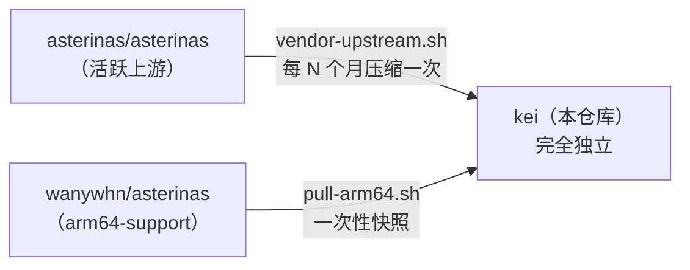

<p align="center"></p>

<h1 align="center">KEI</h1>

<p align="center"><strong>面向物联网的操作系统内核 —— 基于 Asterinas 的 RTOS 级设施，兼顾 Linux 生态接入</strong></p>

<div align="center">

[](../../LICENSE)
[](../../LICENSE-MPL)
[](https://github.com/celestia-island/kei/actions/workflows/ci.yml)

</div>

<div align="center">

[English](../en/README.md) ·
**简体中文** ·
[繁體中文](../zht/README.md) ·
[日本語](../ja/README.md) ·
[한국어](../ko/README.md) ·
[Français](../fr/README.md) ·
[Español](../es/README.md) ·
[Русский](../ru/README.md) ·
[العربية](../ar/README.md)

</div>

## 简介

KEI 是为工业物联网打造的操作系统内核。它在 Asterinas 之上做成一套 RTOS 风格的设施——小、实时、可审计——同时保留通往 Linux 生态的桥梁，让既有的驱动、工具与二进制仍触手可及。它既不是 Linux 发行版，也不是原版 Asterinas。最接近的类比是「一个恰好会说 Linux 的 RTOS」：需要实时确定性的负载得到实时确定性，其余一切享有 Linux 级的软件兼容性。

## 分支模式

KEI **不是**跟踪上游的分支。它是一个独立分支，按自己的节奏定期吸收上游变更 ——
与 Apple 维护其 LLVM 分支采用相同的模式。



KEI 独立维护 `ostd/src/arch/aarch64/`、`kernel/src/arch/aarch64/`、
`bsp/`、`board/`、`configs/` 以及 `docs/`。

## 快速开始

```bash
just setup        # Configure git remotes
just vendor       # Absorb latest upstream asterinas (squash)
just pull-arm64   # Pull ARM64 code from wanywhn fork (one-time)
just versions     # Show what upstream versions we're based on
just build        # Build kernel for nanopi-r3s (aarch64)
just test-all     # Boot-test all architectures in QEMU
```

## 各目录职责

| 目录 | 来源 | 维护方式 |
|-----------|--------|-------------|
| `ostd/` | 上游 asterinas | 定期引入，缺陷就地修复 |
| `ostd/src/arch/aarch64/` | wanywhn 分支（PR #3270） | **独立** —— 由我们维护 |
| `kernel/` | 上游 asterinas | 定期引入 |
| `kernel/src/arch/aarch64/` | wanywhn 分支（PR #3270） | **独立** —— 由我们维护 |
| `osdk/` | 上游 asterinas | 定期引入 |
| `bsp/` | kei | **100% 自研** —— 板级支持包 |
| `board/` `configs/` | kei | **100% 自研** —— 板级定义 |
| `scripts/` `docs/` | kei | **100% 自研** —— 工具与文档 |

## 支持的架构

| 架构 | 状态 | QEMU 测试 |
|------|--------|-----------|
| x86_64 | 上游 Tier 1 | ✅ q35 |
| aarch64 | kei 维护（源自 PR #3270） | ✅ virt/cortex-a55 |
| riscv64 | 上游 Tier 2 | ⚠️ virt/rv64 |
| loongarch64 | 上游 Tier 3 | ⚠️ virt/max |

## 许可证

SySL-1.0（Synthetic Source License）适用于 KEI 自身代码 —— 见 [LICENSE](../../LICENSE)。引入的 Asterinas 代码（`ostd/`、`kernel/`、`osdk/`）仍适用 MPL-2.0 —— 见 [LICENSE-MPL](../../LICENSE-MPL)。
