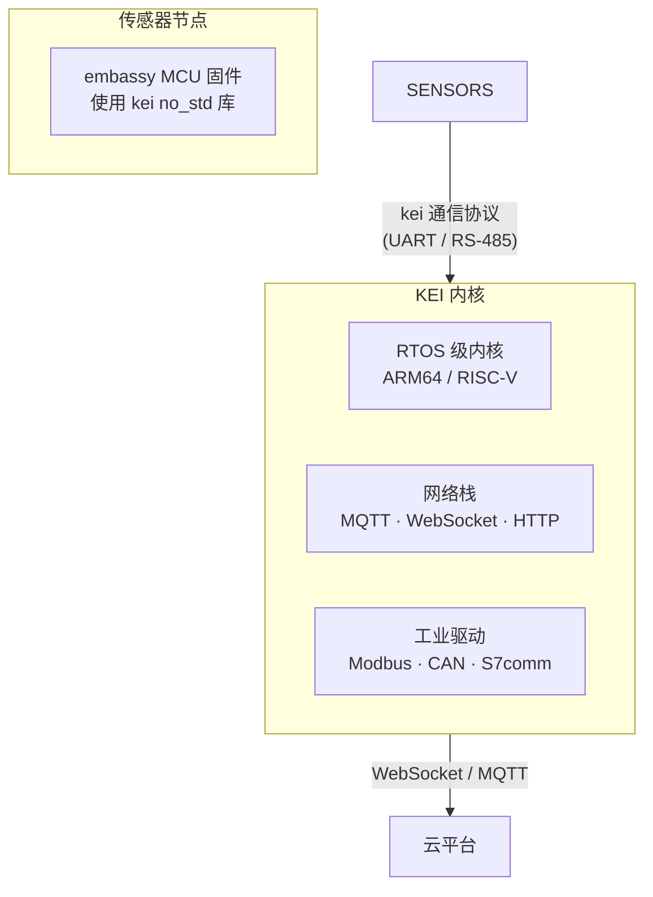

<p align="center"></p>

<h1 align="center">KEI</h1>

<p align="center"><strong>面向工业物联网边缘设备的 Rust OS 内核。</strong></p>

<div align="center">

[](../../LICENSE)
[](../../LICENSE-MPL)
[](https://github.com/celestia-island/kei/actions/workflows/ci.yml)

</div>

<div align="center">

[English](../en/README.md) ·
**简体中文** ·
[繁體中文](../zht/README.md) ·
[日本語](../ja/README.md) ·
[한국어](../ko/README.md) ·
[Français](../fr/README.md) ·
[Español](../es/README.md) ·
[Русский](../ru/README.md) ·
[العربية](../ar/README.md)

</div>

## 简介

KEI 是面向 ARM64 和 RISC-V 边缘设备的 Rust OS 内核。同时附带面向 embassy 传感器节点的 `#![no_std]` 库。

KEI 源自 [Asterinas（星绽）](https://github.com/asterinas/asterinas)，一个 Rust 框架内核。KEI 在其基础上增加了 ARM64 板级支持、virtio-gpu 显示、工业驱动和传感器节点通信协议——同时保持独立于上游的发布周期。



## 仓库内容

| 组件 | 位置 | 说明 |
|------|------|------|
| **KEI 内核** | workspace root | ARM64/RISC-V Rust OS 内核。syscall ABI、virtio-gpu、帧缓冲、网络栈。 |
| **kei 库** | `packages/kei/` | 面向 embassy 传感器节点的 `#![no_std]` 库 |

## 快速开始

**内核：**
```bash
just build        # 构建默认板卡（NanoPi R3S）
just test-all     # 在 QEMU 中启动测试所有架构
```

**库：**
```bash
cd packages/kei
cargo test --all-features
cargo run --example host_demo
```

## 许可证

KEI 自身代码适用 SySL-1.0。引入的 Asterinas 代码适用 MPL-2.0。
详见 [LICENSE](../../LICENSE) 和 [LICENSE-MPL](../../LICENSE-MPL)。
