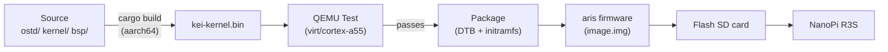
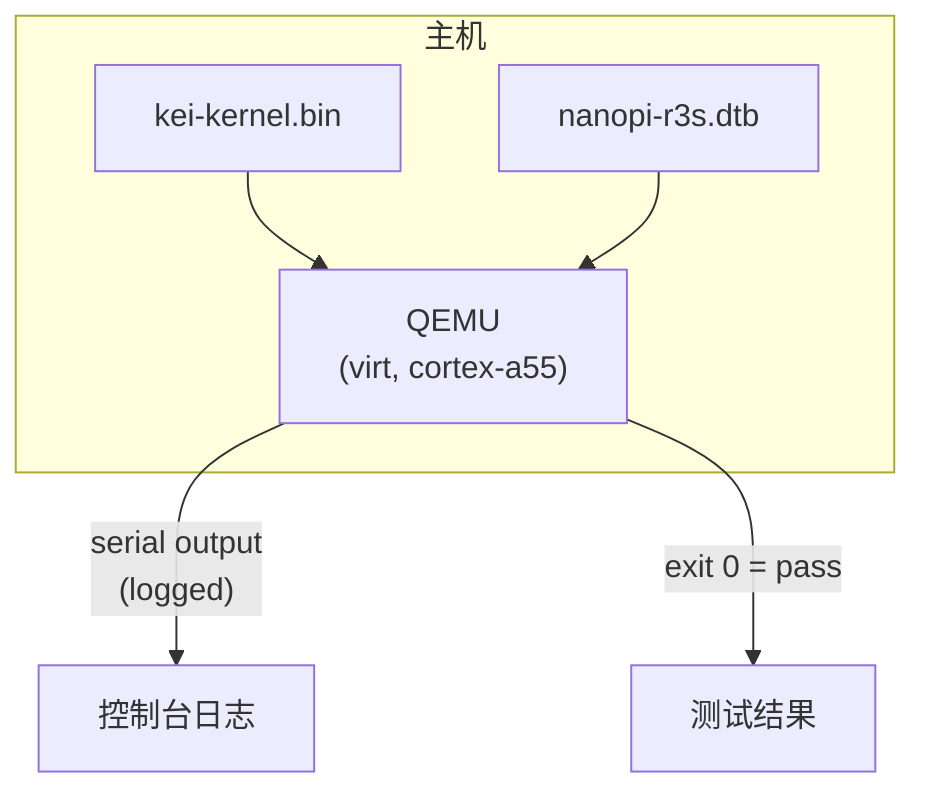
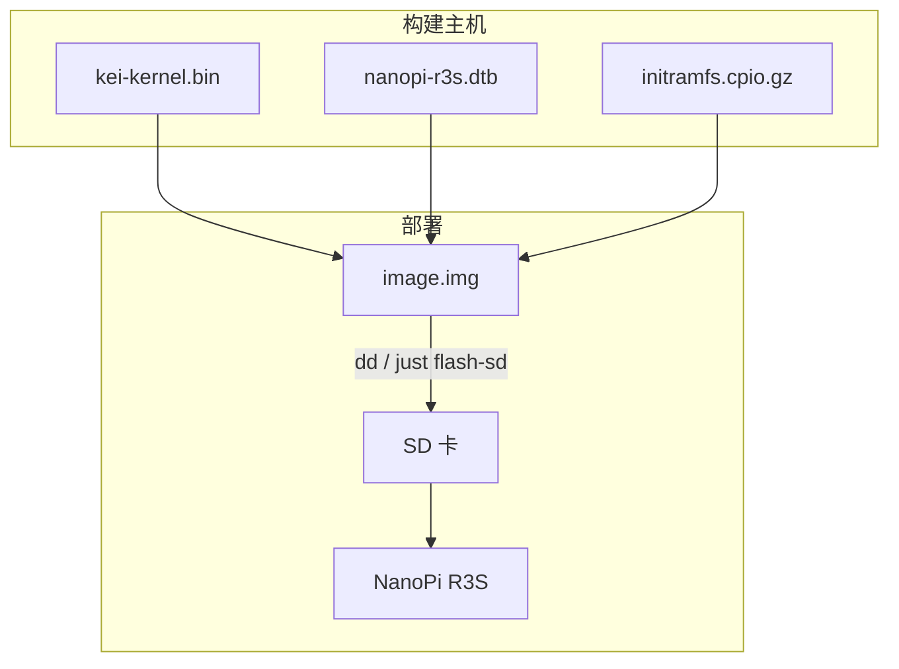
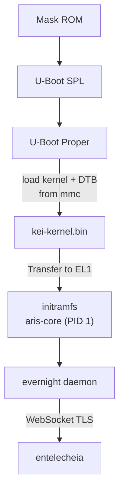

# kei 构建与部署

## 概述

kei 生成 `kei-kernel.bin` — [aris](https://github.com/celestia-island/aris)
所使用的 ARM64 支持的 Asterinas 内核。本指南涵盖内核的构建、QEMU 测试以及
部署到物理硬件。

## 构建流水线



## 先决条件

- **主机**: Linux x86_64 或 ARM64
- **Rust**: 1.85+，含 `aarch64-unknown-none-softfloat` 目标
- **QEMU**: ≥ 8.0，用于 cortex-a55 的 virt 机器
- **just**: `cargo install just`

## 快速构建

```bash
# One-time setup
just setup        # Configure git remotes and Rust targets

# Sync upstream sources
just vendor       # Absorb latest upstream asterinas (squash)
just pull-arm64   # Pull ARM64 code from wanywhn fork (one-time)
just versions     # Show upstream baseline versions

# Build for the NanoPi R3S
just build        # Builds kei-kernel.bin for aarch64/armv8

# Run QEMU boot tests
just test-all     # Boot-tests all supported architectures
```

## 交叉编译

从 x86_64 交叉编译到 aarch64：

```bash
# Add the ARM64 target (one-time)
rustup target add aarch64-unknown-none-softfloat

# Install GCC cross-toolchain (distribution-dependent)
# Ubuntu / Debian:
sudo apt install gcc-aarch64-linux-gnu binutils-aarch64-linux-gnu

# Build
cargo build --release --target aarch64-unknown-none-softfloat \
  -p kei-kernel
```

内核二进制文件是原始 ARM64 Image（Linux 启动协议），而非 ELF。它通过
`booti` 命令直接从 U-Boot 启动。

## QEMU 测试

在部署到硬件之前，请在 QEMU 中测试内核：



### 测试矩阵

| QEMU 机器 | CPU | RAM | 状态 | 命令 |
|-------------|-----|-----|--------|---------|
| virt | cortex-a55 | 2GB | ✅ 主要 | `just test` |
| virt | cortex-a72 | 2GB | 🔲 计划中 | — |
| virt | max | 4GB | 🔲 计划中 | — |
| sbsa-ref | max | 4GB | 🔲 计划中 | — |

```bash
# Run the primary test target
just test

# Manual QEMU invocation
qemu-system-aarch64 \
  -machine virt,gic-version=3 \
  -cpu cortex-a55 \
  -m 2G \
  -kernel output/kei-kernel.bin \
  -nographic
```

## 物理部署

### NanoPi R3S

将 kei 部署到物理 NanoPi R3S：



### 烧录到 SD 卡

```bash
# Build the complete firmware image (includes kei-kernel.bin)
# Run from aris repository — aris packages kei as a submodule/dependency
just build-board nanopi-r3s

# Flash to SD card
sudo dd if=output/nanopi-r3s/image.img of=/dev/sdX bs=4M status=progress
sync
```

### 启动验证

插入 SD 卡并上电后，通过 USB-TTL 串口（1500000 波特，8N1）连接：

```
U-Boot 2024.01 (Jan 01 2024 - 00:00:00 +0000)
...
## Loading kernel from mmc 0:1
   Image Name:   kei-kernel
   Image Type:   AArch64 Linux Kernel Image
   Data Size:    4194304 Bytes = 4 MiB
   Load Address: 00000000
   Entry Point:  00000000
## Flattened Device Tree blob at 44000000
   Booting using the fdt blob at 0x44000000

kei-kernel booting...
[KEI] initialising GICv3...
[KEI] initialising ARM Generic Timer...
[KEI] starting SMP...
[KEI] 4 cores online
...
aris-core v0.1.0 starting...
evernight daemon starting...
```

### 启动顺序



## 与 aris 集成

kei 提供内核二进制文件；aris 将其打包为可启动的镜像：

```
aris repository                     kei repository
─────────────────                   ─────────────────
packages/core/        supervisor    kernel/          kernel source
packages/builder/     image builder ostd/            core infra
overlay/              rootfs files  bsp/             board support
scripts/              build + flash board/           board configs
│                                    │
│  just build-board                  │  just build
│    ├── cross-compile aris-core     │    └── cargo build (aarch64)
│    ├── fetch kei-kernel.bin        │
│    ├── assemble image.img          │
│    └── just flash-sd /dev/sdX      │
```

验证集成：

```bash
# In aris repo: build with kei kernel
just build-board nanopi-r3s

# Boot in QEMU with the full image
just test-qemu

# Verify kei kernel version in boot log
grep "kei-kernel" output/boot.log
```

## 故障排除

| 症状 | 可能原因 | 操作 |
|---------|-------------|--------|
| 无串口输出 | 波特率错误 | 使用 1500000，而非 115200 |
| GICv3 初始化失败 | QEMU 机器类型 | 使用 `virt,gic-version=3` |
| SMP 失败 | DTB 中缺少 PSCI | 检查设备树中的 `/cpus` 节点 |
| Kernel panic | LLM 生成的代码工件 | 审计 `ostd/src/arch/aarch64/` |
| U-Boot 找不到内核 | 分区偏移错误 | 检查 `boot.scr` 中的偏移量 |
| evernight 无法连接 | 网络未配置 | 检查 `/data/network.toml` |
