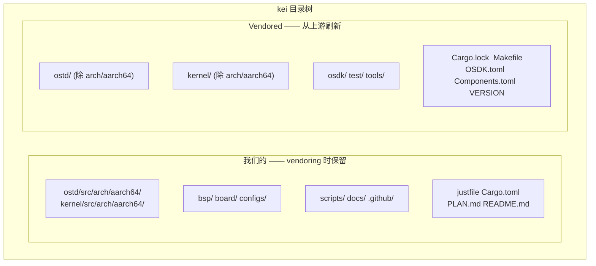
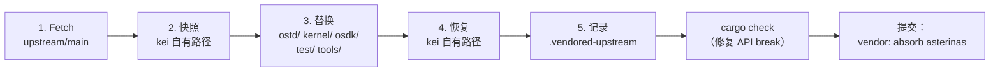

# kei 上游同步（Vendoring）

## 概述

kei 是 [asterinas/asterinas](https://github.com/asterinas/asterinas) 的**独立
fork**。它**不**通过 `git merge` 跟踪上游，而是周期性地以 **squash
vendoring** 方式吸收上游变更 —— 与 Apple 维护其 LLVM fork 的模式相同。本指南
说明这么做的原因、同步的范围，以及执行一次上游同步的完整步骤。

## 为什么不用 `git merge`？

kei 的 dev 分支与 `upstream/main` **没有任何 git 血缘** —— 这是刻意为之，并非
遗漏：

```bash
$ git merge-base dev upstream/main
fatal: not a single merge base  # ← 符合预期
```

| 方案 | 结论 | 原因 |
|------|------|------|
| `git merge` 跟踪 | ❌ | 4475 行的 ARM64 架构移植让每次 merge 冲突密集、成本高昂 |
| 补丁系列（quilt） | ❌ | 这个体量下很脆弱，无 IDE 支持 |
| **独立 fork + squash vendor** | ✅ | 全权掌控；按自身节奏吸收上游；冲突一次性在 vendor 时解决 |

该模型的代价：跨 vendor 边界无法用 `git log` / `git blame` 追溯文件历史（每次
吸收都 squash 成一条提交）。这是为换取廉价、可预期的上游吸收而接受的取舍。

## 哪些是我们的、哪些是 vendored 的



| 路径 | 来源 | `just vendor` 时 |
|------|------|------------------|
| `ostd/src/arch/aarch64/` | wanywhn fork (PR #3270) | **保留**（我们的） |
| `kernel/src/arch/aarch64/` | wanywhn fork (PR #3270) | **保留**（我们的） |
| `bsp/` `board/` `configs/` | kei | **保留**（我们的） |
| `scripts/` `docs/` `.github/` | kei | **保留**（我们的） |
| `ostd/`（其余） | 上游 | 整体替换 |
| `kernel/`（其余） | 上游 | 整体替换 |
| `osdk/` `test/` `tools/` | 上游 | 整体替换 |
| `Cargo.lock` `Makefile` `OSDK.toml` `Components.toml` `VERSION` | 上游 | 替换（`Cargo.toml` 是合并而非替换） |

## Vendoring 如何运作（5 步）

`scripts/vendor_upstream.py` 执行的是目录级替换，**不是** git merge。完整流程：



1. **Fetch** —— `git fetch upstream main`（或指定 pin 的 ref）。
2. **快照** —— kei 自有路径拷贝到临时目录（保留符号链接）。
3. **替换** —— 删除 `ostd/`、`kernel/`、`osdk/`、`test/`、`tools/`，从
   `upstream/main` 重新 checkout。根目录文件（`Cargo.lock`、`Makefile`、
   `OSDK.toml`、`Components.toml`、`VERSION`）也一并刷新。
4. **恢复** —— kei 自有路径叠回顶层，包括 ARM64 架构代码
   （`ostd/src/arch/aarch64/`、`kernel/src/arch/aarch64/`）。
5. **记录** —— 重写 `.vendored-upstream`，写入新的上游 SHA、ref、日期和 vendor
   时间戳。

脚本**不会**自动提交。跑完后你必须自行验证并提交（见下方[工作流](#工作流)）。

## 工作流

### 前置条件

`just setup` 会配置 `upstream` 和 `arm64` 远程：

```bash
just setup        # 配置 git 远程（upstream、arm64）与 Rust 目标
```

如果你的环境需要代理，运行 vendor 前设置 `HTTPS_PROXY` / `HTTP_PROXY`（脚本会
读取）。要让 GitHub 绕过代理，导出 `NO_PROXY='*'`。

### 吸收上游（常规同步）

```bash
# 1. 运行 vendor（fetch upstream/main，替换 vendored 目录，恢复自有代码）
just vendor

# 2. 查看变更
git status
git diff --stat

# 3. 修复上游变更引起的任何 API break
cargo check
just test-all

# 4. 作为单条 squash 提交落盘
git add -A
git commit -m "vendor: absorb asterinas <upstream-sha>"
```

vendor 指定 commit 或 tag（而非 `main`）：

```bash
just vendor-ref v0.12.0      # justfile: just vendor-ref <ref>
# 或直接：
python3 scripts/vendor_upstream.py <commit-sha-or-tag>
```

### 拉取 ARM64 代码（一次性，或偶尔重新同步）

ARM64 架构代码来自 [`wanywhn/asterinas`](https://github.com/wanywhn/asterinas)
（分支 `arm64-support`，PR asterinas/asterinas#3270）。首次拉取后在 kei 内独立
维护。

```bash
just pull-arm64              # 从 wanywhn/asterinas 一次性快照
just pull-arm64-ref <ref>    # 重新同步到指定 commit（罕见）
```

### 查看当前基线

```bash
just versions                # 打印 .vendored-upstream 与 .vendored-arm64
```

示例输出：

```
=== Upstream asterinas ===
upstream_url=https://github.com/asterinas/asterinas.git
upstream_ref=main
upstream_sha=3a34935ba3ebdfbc96472e992acda5a74d3b9352
upstream_date=2026-07-04 23:08:32 -0700

=== ARM64 source ===
arm64_url=https://github.com/wanywhn/asterinas.git
arm64_ref=arm64-support
arm64_sha=1437f77b69df2f39a3c5faf87ef3b447c03f1cec
arm64_date=2026-05-25 09:13:57 +0800
```

## 解决 API break

由于 kei 的 ARM64 代码独立维护，一次上游 vendor 可能改动了 ARM64 代码依赖的
API。vendor 脚本无法自动修复 —— 你需在工作流第 3 步之后手动解决：

```bash
cargo check 2>&1 | tee /tmp/vendor-check.log
# 逐个修复编译错误，然后：
just test-all
```

常见 break 与修法：

| 症状 | 可能原因 | 修法 |
|------|----------|------|
| `cannot find type/function X` | 上游重命名/移除 | 更新 `ostd/src/arch/aarch64/`、`kernel/src/arch/aarch64/` 的调用点 |
| `trait bound not satisfied` | 上游改了 trait 签名 | 让 ARM64 实现适配新签名 |
| `unresolved import` | 上游重组了模块 | 更新 ARM64 代码里的 `use` 路径 |
| `kernel/` 链接错误 | 上游迁移了组件 | 调整 `Cargo.toml` 成员列表（合并，非替换） |

只允许修改 `ostd/src/arch/aarch64/`、`kernel/src/arch/aarch64/`、`bsp/`、
`board/`、`configs/` 以及合并后的 `Cargo.toml`。`ostd/`、`kernel/`、`osdk/`、
`test/`、`tools/` 下的其余内容都归上游所有 —— 不要就地打补丁，否则下次 vendor
会丢失。

## 何时 vendor

- **常规**：每 3–6 个月，批量获取上游修复与特性。
- **关键修复**：急需某个特定上游 commit 时提前 vendor（用
  `just vendor-ref <sha>` pin 住）。

不存在持续的上游跟踪 —— 这正是该模型的核心。

## 验证清单

vendor 完成后、提交之前：

- [ ] `git diff --stat` 的变更**仅**出现在 `ostd/`、`kernel/`、`osdk/`、
      `test/`、`tools/`、根目录文件和 `.vendored-upstream`。
- [ ] `bsp/`、`board/`、`configs/`、`scripts/`、`docs/`、`.github/`
      **未改动**。
- [ ] `ostd/src/arch/aarch64/` 与 `kernel/src/arch/aarch64/` 完好（我们的）。
- [ ] `cargo check` 通过（或所有 break 已修）。
- [ ] `just test-all` 能在 QEMU 启动 aarch64 目标。
- [ ] `.vendored-upstream` 反映新的上游 SHA。

## 另见

- [构建与部署](./deployment.md)
- [ARM64 支持状态](../arm64-status.md)
- [板级支持包指南](../bsp-guide.md)
