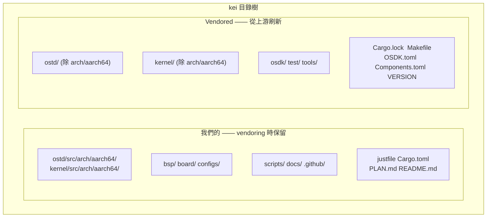
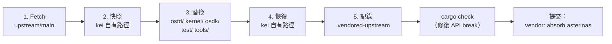

# kei 上游同步（Vendoring）

## 概述

kei 是 [asterinas/asterinas](https://github.com/asterinas/asterinas) 的**獨立
fork**。它**不**透過 `git merge` 追蹤上游，而是週期性地以 **squash
vendoring** 方式吸收上游變更 —— 與 Apple 維護其 LLVM fork 的模式相同。本指南
說明這麼做的原因、同步的範圍，以及執行一次上游同步的完整步驟。

## 為什麼不用 `git merge`？

kei 的 dev 分支與 `upstream/main` **沒有任何 git 血緣** —— 這是刻意為之，並非
遺漏：

```bash
$ git merge-base dev upstream/main
fatal: not a single merge base  # ← 符合預期
```

| 方案 | 結論 | 原因 |
|------|------|------|
| `git merge` 追蹤 | ❌ | 4475 行的 ARM64 架構移植讓每次 merge 衝突密集、成本高昂 |
| 補丁系列（quilt） | ❌ | 這個體量下很脆弱，無 IDE 支援 |
| **獨立 fork + squash vendor** | ✅ | 全權掌控；按自身節奏吸收上游；衝突一次性在 vendor 時解決 |

該模型的代價：跨 vendor 邊界無法用 `git log` / `git blame` 追溯檔案歷史（每次
吸收都 squash 成一條提交）。這是為換取廉價、可預期的上游吸收而接受的取捨。

## 哪些是我們的、哪些是 vendored 的



| 路徑 | 來源 | `just vendor` 時 |
|------|------|------------------|
| `ostd/src/arch/aarch64/` | wanywhn fork (PR #3270) | **保留**（我們的） |
| `kernel/src/arch/aarch64/` | wanywhn fork (PR #3270) | **保留**（我們的） |
| `bsp/` `board/` `configs/` | kei | **保留**（我們的） |
| `scripts/` `docs/` `.github/` | kei | **保留**（我們的） |
| `ostd/`（其餘） | 上游 | 整體替換 |
| `kernel/`（其餘） | 上游 | 整體替換 |
| `osdk/` `test/` `tools/` | 上游 | 整體替換 |
| `Cargo.lock` `Makefile` `OSDK.toml` `Components.toml` `VERSION` | 上游 | 替換（`Cargo.toml` 是合併而非替換） |

## Vendoring 如何運作（5 步）

`scripts/vendor_upstream.py` 執行的是目錄級替換，**不是** git merge。完整流程：



1. **Fetch** —— `git fetch upstream main`（或指定 pin 的 ref）。
2. **快照** —— kei 自有路徑拷貝到臨時目錄（保留符號連結）。
3. **替換** —— 刪除 `ostd/`、`kernel/`、`osdk/`、`test/`、`tools/`，從
   `upstream/main` 重新 checkout。根目錄檔案（`Cargo.lock`、`Makefile`、
   `OSDK.toml`、`Components.toml`、`VERSION`）也一併刷新。
4. **恢復** —— kei 自有路徑疊回頂層，包括 ARM64 架構程式碼
   （`ostd/src/arch/aarch64/`、`kernel/src/arch/aarch64/`）。
5. **記錄** —— 重寫 `.vendored-upstream`，寫入新的上游 SHA、ref、日期和 vendor
   時間戳。

腳本**不會**自動提交。跑完後你必須自行驗證並提交（見下方[工作流程](#工作流程)）。

## 工作流程

### 前置條件

`just setup` 會設定 `upstream` 和 `arm64` 遠端：

```bash
just setup        # 設定 git 遠端（upstream、arm64）與 Rust 目標
```

如果你的環境需要代理，執行 vendor 前設定 `HTTPS_PROXY` / `HTTP_PROXY`（腳本會
讀取）。要讓 GitHub 繞過代理，匯出 `NO_PROXY='*'`。

### 吸收上游（常規同步）

```bash
# 1. 執行 vendor（fetch upstream/main，替換 vendored 目錄，恢復自有程式碼）
just vendor

# 2. 檢視變更
git status
git diff --stat

# 3. 修復上游變更引起的任何 API break
cargo check
just test-all

# 4. 作為單條 squash 提交落盤
git add -A
git commit -m "vendor: absorb asterinas <upstream-sha>"
```

vendor 指定 commit 或 tag（而非 `main`）：

```bash
just vendor-ref v0.12.0      # justfile: just vendor-ref <ref>
# 或直接：
python3 scripts/vendor_upstream.py <commit-sha-or-tag>
```

### 拉取 ARM64 程式碼（一次性，或偶爾重新同步）

ARM64 架構程式碼來自 [`wanywhn/asterinas`](https://github.com/wanywhn/asterinas)
（分支 `arm64-support`，PR asterinas/asterinas#3270）。首次拉取後在 kei 內獨立
維護。

```bash
just pull-arm64              # 從 wanywhn/asterinas 一次性快照
just pull-arm64-ref <ref>    # 重新同步到指定 commit（罕見）
```

### 檢視目前基線

```bash
just versions                # 印出 .vendored-upstream 與 .vendored-arm64
```

範例輸出：

```
=== Upstream asterinas ===
upstream_url=https://github.com/asterinas/asterinas.git
upstream_ref=main
upstream_sha=3a34935ba3ebdfbc96472e992acda5a74d3b9352
upstream_date=2026-07-04 23:08:32 -0700

=== ARM64 source ===
arm64_url=https://github.com/wanywhn/asterinas.git
arm64_ref=arm64-support
arm64_sha=1437f77b69df2f39a3c5faf87ef3b447c03f1cec
arm64_date=2026-05-25 09:13:57 +0800
```

## 解決 API break

由於 kei 的 ARM64 程式碼獨立維護，一次上游 vendor 可能改動了 ARM64 程式碼依賴
的 API。vendor 腳本無法自動修復 —— 你需在工作流程第 3 步之後手動解決：

```bash
cargo check 2>&1 | tee /tmp/vendor-check.log
# 逐個修復編譯錯誤，然後：
just test-all
```

常見 break 與修法：

| 症狀 | 可能原因 | 修法 |
|------|----------|------|
| `cannot find type/function X` | 上游重新命名/移除 | 更新 `ostd/src/arch/aarch64/`、`kernel/src/arch/aarch64/` 的呼叫點 |
| `trait bound not satisfied` | 上游改了 trait 簽章 | 讓 ARM64 實作適配新簽章 |
| `unresolved import` | 上游重組了模組 | 更新 ARM64 程式碼裡的 `use` 路徑 |
| `kernel/` 連結錯誤 | 上游遷移了元件 | 調整 `Cargo.toml` 成員列表（合併，非替換） |

只允許修改 `ostd/src/arch/aarch64/`、`kernel/src/arch/aarch64/`、`bsp/`、
`board/`、`configs/` 以及合併後的 `Cargo.toml`。`ostd/`、`kernel/`、`osdk/`、
`test/`、`tools/` 下的其餘內容都歸上游所有 —— 不要就地打補丁，否則下次 vendor
會遺失。

## 何時 vendor

- **常規**：每 3–6 個月，批次取得上游修復與特性。
- **關鍵修復**：急需某個特定上游 commit 時提前 vendor（用
  `just vendor-ref <sha>` pin 住）。

不存在持續的上游追蹤 —— 這正是該模型的核心。

## 驗證清單

vendor 完成、提交之前：

- [ ] `git diff --stat` 的變更**僅**出現在 `ostd/`、`kernel/`、`osdk/`、
      `test/`、`tools/`、根目錄檔案和 `.vendored-upstream`。
- [ ] `bsp/`、`board/`、`configs/`、`scripts/`、`docs/`、`.github/`
      **未改動**。
- [ ] `ostd/src/arch/aarch64/` 與 `kernel/src/arch/aarch64/` 完好（我們的）。
- [ ] `cargo check` 通過（或所有 break 已修）。
- [ ] `just test-all` 能在 QEMU 啟動 aarch64 目標。
- [ ] `.vendored-upstream` 反映新的上游 SHA。

## 另見

- [建置與部署](./deployment.md)
- [ARM64 支援狀態](../arm64-status.md)
- [板級支援包指南](../bsp-guide.md)
